# EELU Library Hub
## Software Engineering Documentation Package
### Egyptian E-Learning University — Graduation Project

---

> **Document Version:** 1.0  
> **Date:** June 2026  
> **Classification:** Academic / University Graduation Project

---

## Table of Contents

1. [Project Overview](#1-project-overview)
2. [System Architecture](#2-system-architecture)
3. [Technology Stack](#3-technology-stack)
4. [Functional Requirements](#4-functional-requirements)
5. [Non-Functional Requirements](#5-non-functional-requirements)
6. [User Roles and Permissions](#6-user-roles-and-permissions)
7. [Database Design](#7-database-design)
8. [API Documentation](#8-api-documentation)
9. [Use Case Analysis](#9-use-case-analysis)
10. [Security and Privacy Considerations](#10-security-and-privacy-considerations)
11. [Frontend Structure](#11-frontend-structure)
12. [Backend Structure](#12-backend-structure)
13. [Assumptions and Constraints](#13-assumptions-and-constraints)
14. [Future Enhancements](#14-future-enhancements)

---

## 1. Project Overview

### 1.1 Purpose

The **EELU Library Hub** is a full-stack digital library management system developed for the **Egyptian E-Learning University (EELU)**. The system provides a centralised platform that enables students to discover, borrow, reserve, and manage academic books online, while equipping administrators with comprehensive tools to manage the library catalogue, user accounts, and loan transactions.

The platform is designed with an inclusive philosophy, incorporating a dedicated accessibility layer that supports users with visual impairments, mobility limitations, and other special needs — a core commitment of EELU's e-learning model.

### 1.2 Objectives

The primary objectives of the EELU Library Hub are:

1. **Digitise library operations** by replacing manual borrowing registers with an automated, real-time system.
2. **Improve academic resource access** by enabling students to search, filter, and access library materials from any device.
3. **Enforce institutional access control** through role-based authentication ensuring only registered EELU students and verified administrators may interact with the system.
4. **Support inclusive education** through a built-in accessibility module covering font-size adjustment, high-contrast mode, screen-reader support, and keyboard shortcuts.
5. **Provide administrative oversight** via a dedicated admin dashboard with real-time statistics, full book CRUD management, user lifecycle management, and loan tracking.
6. **Facilitate student–library communication** through an integrated contact and support request system.

### 1.3 Scope

**In Scope:**
- Student registration and authentication using university email addresses.
- Book catalogue management (add, edit, archive, restore, delete).
- Book borrowing, reservation, return, and cancellation workflows.
- Real-time copy availability tracking.
- Admin dashboard with statistics, user management, and loan management.
- Accessibility features (font size, high contrast, screen reader, keyboard shortcuts).
- Contact and support message system.
- Responsive design supporting desktop, tablet, and mobile viewports.

**Out of Scope:**
- Physical library barcode scanning or RFID integration.
- Payment gateway for library fines.
- Email notification system (e.g., due-date reminders).
- Integration with EELU's existing LMS or student information system.
- Mobile native applications (iOS/Android).

### 1.4 Problem Statement

Egyptian E-Learning University operates a distributed student body learning entirely online. Traditional physical library access is inherently incompatible with an e-learning model. Students lack a unified digital interface to:

- Discover what academic resources are available for their specific faculty and academic year.
- Reserve or borrow books without physical presence.
- Track their loan status, due dates, and overdue items.

Simultaneously, library administrators manage catalogues, track copies, and handle student enquiries through disconnected and often manual processes. The absence of a unified digital library system creates friction in academic resource access, increases administrative overhead, and excludes students with accessibility needs from equitable participation.

The **EELU Library Hub** addresses all of these pain points through a coherent, secure, and accessible web-based platform.

---

## 2. System Architecture

### 2.1 High-Level Architecture

The system follows a classic **three-tier architecture** pattern:

```
┌─────────────────────────────────────────────────────┐
│                  CLIENT TIER                        │
│  ┌─────────────────────┐  ┌────────────────────┐   │
│  │  Student Frontend   │  │  Admin Dashboard   │   │
│  │  (HTML/CSS/JS)      │  │  (SPA Module JS)   │   │
│  └─────────────────────┘  └────────────────────┘   │
└──────────────────────┬──────────────────────────────┘
                       │  HTTP/REST (JSON)
                       │  JWT Bearer Token
┌──────────────────────▼──────────────────────────────┐
│                 APPLICATION TIER                    │
│           Node.js + Express REST API                │
│  ┌──────────┐ ┌────────────┐ ┌──────────────────┐  │
│  │  Routes  │ │Controllers │ │   Middleware      │  │
│  └──────────┘ └────────────┘ └──────────────────┘  │
└──────────────────────┬──────────────────────────────┘
                       │  Mongoose ODM
┌──────────────────────▼──────────────────────────────┐
│                   DATA TIER                         │
│              MongoDB (NoSQL Database)               │
│   Users │ Books │ Borrowed │ ContactMessages        │
└─────────────────────────────────────────────────────┘
```

### 2.2 Frontend Architecture

The student-facing frontend is a **Multi-Page Application (MPA)** built with plain HTML5, CSS3, Bootstrap 5, and vanilla JavaScript ES6+. Each page is a self-contained HTML file that loads its own JavaScript module. A shared `accessibility-init.js` script runs on every page to restore user accessibility preferences and initialise the mobile navigation sidebar.

```
frontend/
├── index.html          ← Landing / page navigator (public)
├── login.html          ← Authentication
├── register.html       ← Account creation
├── combined.html       ← Student home page (protected)
├── search.html         ← Book catalogue & search (protected)
├── book-details.html   ← Single book view (protected)
├── my-borrowed.html    ← Personal loan dashboard (protected)
├── accessibility.html  ← Accessibility settings (protected)
├── contact.html        ← Support & contact (protected)
├── styles.css          ← Unified stylesheet
└── accessibility-init.js ← Shared initialisation (all pages)
```

State management is handled entirely through `localStorage` for session persistence (JWT token, user profile, accessibility preferences).

### 2.3 Backend Architecture

The backend is a **RESTful API** built with Node.js and Express 5. It follows a layered architecture pattern:

```
backend/
├── server.js           ← Entry point, middleware registration, route mounting
├── config/
│   └── db.js           ← MongoDB connection via Mongoose
├── routes/             ← Route definitions (HTTP verb + path → controller)
├── controllers/        ← Business logic handlers
├── models/             ← Mongoose schemas and models
├── middleware/         ← Auth, admin guard, error handling, validation
└── utils/
    └── generateToken.js ← JWT signing utility
```

**Request Lifecycle:**

```
Request
  → CORS + Helmet + Body Parser (server.js)
  → Route matching (routes/)
  → Authentication Middleware (protect)
  → Role Guard Middleware (adminOnly) [if required]
  → Input Validation (validators.js)
  → Controller Function
  → Mongoose Model Operation
  → JSON Response
```

### 2.4 Database Architecture

The database layer uses **MongoDB** with **Mongoose ODM**. The schema design is document-oriented with ObjectId references between collections (rather than embedded documents) to support independent querying and efficient updates.

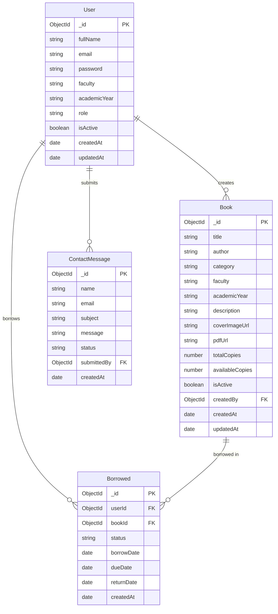

---

## 3. Technology Stack

### 3.1 Backend Technologies

| Component | Technology | Version | Justification |
|---|---|---|---|
| Runtime | Node.js | ≥ 18 | Non-blocking I/O ideal for API servers |
| Framework | Express | 5.x | Minimal, flexible, mature ecosystem |
| Database | MongoDB | 6+ | Flexible schema suits library documents |
| ODM | Mongoose | 9.x | Schema validation, middleware, population |
| Authentication | JSON Web Tokens (jsonwebtoken) | 9.x | Stateless auth, suitable for SPA/MPA |
| Password Hashing | bcrypt | 5.x | Industry-standard password hashing |
| Security Headers | Helmet | 7.x | Automatic HTTP security headers |
| CORS | cors | 2.x | Cross-origin resource sharing control |
| Input Validation | validator.js | 13.x | Email and string validation utilities |
| Environment Config | dotenv | 16.x | Secure environment variable management |

### 3.2 Frontend Technologies

| Component | Technology | Version | Justification |
|---|---|---|---|
| Markup | HTML5 | — | Semantic, accessible structure |
| Styling | CSS3 + Bootstrap | 5.3.3 | Responsive grid, utility classes |
| Icons | Bootstrap Icons | 1.11.3 | Consistent icon library |
| Typography | Inter (Google Fonts) | — | Clean, readable academic font |
| Scripting | Vanilla JavaScript | ES6+ | No framework overhead, browser-native |
| HTTP Client | Fetch API | — | Built-in, promise-based |

### 3.3 Admin Dashboard Technologies

| Component | Technology | Notes |
|---|---|---|
| Architecture | ES Modules SPA | `type="module"` scripts |
| Charting | Chart.js | 4.4.1 (loaded but ready for integration) |
| State | localStorage | adminToken, adminUser, theme |
| Avatar | Inline SVG (data URI) | Zero external requests |

### 3.4 Development & Infrastructure

| Tool | Purpose |
|---|---|
| npm | Package management |
| nodemon | Development auto-restart |
| Git | Version control |
| MongoDB Atlas / Local | Database hosting |

---

## 4. Functional Requirements

### 4.1 Authentication & Account Management

| ID | Requirement | Priority |
|---|---|---|
| FR-01 | The system shall allow users to register using a valid email address, full name, faculty selection (IT/BA), and academic year | HIGH |
| FR-02 | The system shall require a minimum password length of 8 characters | HIGH |
| FR-03 | The system shall authenticate users by validating credentials and issuing a signed JWT token | HIGH |
| FR-04 | The system shall prevent login for deactivated accounts | HIGH |
| FR-05 | The system shall allow authenticated users to view and update their profile (name, faculty, year) | MEDIUM |
| FR-06 | The system shall allow authenticated users to change their password, requiring the current password for verification | MEDIUM |
| FR-07 | Administrators shall authenticate through a separate admin login that verifies role | HIGH |
| FR-08 | The system shall automatically redirect users based on role: admin → dashboard, student → search | MEDIUM |

### 4.2 Book Catalogue Management

| ID | Requirement | Priority |
|---|---|---|
| FR-09 | The system shall allow administrators to create book records with: title, author, category, faculty, academic year, description, total copies, available copies, cover image URL, and PDF URL | HIGH |
| FR-10 | The system shall allow administrators to update any book field | HIGH |
| FR-11 | The system shall support soft-deletion of books (archive), preserving historical loan records | HIGH |
| FR-12 | The system shall allow administrators to restore archived books | MEDIUM |
| FR-13 | The system shall support full-text search across title, author, category, and description | HIGH |
| FR-14 | The system shall support filtering books by faculty, academic year, and category | HIGH |
| FR-15 | The system shall expose book availability (available copies / total copies) to all users | HIGH |

### 4.3 Borrowing & Reservation

| ID | Requirement | Priority |
|---|---|---|
| FR-16 | The system shall allow authenticated students to borrow available books, decrementing available copies atomically | HIGH |
| FR-17 | The system shall set a default loan duration of 14 days from the borrow date | HIGH |
| FR-18 | The system shall allow students to reserve unavailable books without decrementing copy count | HIGH |
| FR-19 | The system shall allow students to return borrowed books, incrementing available copies atomically | HIGH |
| FR-20 | The system shall allow students to cancel their own reservations | HIGH |
| FR-21 | The system shall track overdue loans (dueDate < current date and status = "borrowed") | HIGH |
| FR-22 | The system shall display a personalised loan dashboard showing active loans, reservations, and due-date warnings | HIGH |
| FR-23 | Administrators shall be able to view all loan transactions across all users | HIGH |
| FR-24 | Administrators shall be able to process returns and cancel reservations on behalf of users | MEDIUM |

### 4.4 User Management (Admin)

| ID | Requirement | Priority |
|---|---|---|
| FR-25 | Administrators shall be able to view all registered user accounts | HIGH |
| FR-26 | Administrators shall be able to promote a student to admin role | HIGH |
| FR-27 | Administrators shall be able to demote an admin to student role | HIGH |
| FR-28 | Administrators shall be able to deactivate and reactivate user accounts | HIGH |

### 4.5 Contact & Support

| ID | Requirement | Priority |
|---|---|---|
| FR-29 | Authenticated users shall be able to submit a contact message with name, email, subject, and message body | MEDIUM |
| FR-30 | Administrators shall be able to view all contact messages | MEDIUM |
| FR-31 | Administrators shall be able to update message status (new → read → resolved) | MEDIUM |
| FR-32 | Administrators shall be able to delete contact messages | LOW |

### 4.6 Accessibility

| ID | Requirement | Priority |
|---|---|---|
| FR-33 | The system shall allow users to adjust font size between 80% and 150% in 10% increments | HIGH |
| FR-34 | The system shall provide a high-contrast mode (dark background, yellow text) | HIGH |
| FR-35 | The system shall support a screen-reader mode with ARIA live region announcements | HIGH |
| FR-36 | The system shall provide keyboard shortcuts (Shift+C for contact, Shift+R for search) | MEDIUM |
| FR-37 | All accessibility preferences shall persist across page navigation via localStorage | HIGH |

### 4.7 User Stories

**As a Student:**
- *"I want to search for books by title or author so that I can quickly find what I need for my course."*
- *"I want to filter books by my faculty (IT/BA) and academic year so that I see relevant materials."*
- *"I want to borrow a book online so that I can access it without visiting the library physically."*
- *"I want to reserve a book that is currently unavailable so that I am notified when it becomes free."*
- *"I want to see my currently borrowed books and when they are due so that I can avoid overdue penalties."*
- *"I want to return a book through the system so that my loan record is updated immediately."*
- *"I want to adjust font sizes and enable high-contrast mode so that the platform is comfortable for my visual needs."*

**As an Administrator:**
- *"I want to add new books to the catalogue so that students have access to the latest academic resources."*
- *"I want to archive outdated books so that they no longer appear in search results without losing historical data."*
- *"I want to see how many books are currently borrowed and overdue so that I can manage library inventory."*
- *"I want to manage user accounts so that I can deactivate inactive or misusing students."*
- *"I want to search across books, members, and loans from a single search bar so that I can find information quickly."*

### 4.8 Business Rules

| ID | Rule |
|---|---|
| BR-01 | A book cannot be borrowed if `availableCopies == 0`; only reservation is permitted |
| BR-02 | `availableCopies` must always be `≥ 0` and `≤ totalCopies` |
| BR-03 | Borrowing and returning operations must be atomic to prevent race conditions |
| BR-04 | A deactivated user cannot log in or perform any authenticated operation |
| BR-05 | Only users with role `"admin"` may access the admin dashboard or admin API endpoints |
| BR-06 | Student registration always assigns `role = "student"`; role escalation requires admin action |
| BR-07 | Soft-deleted books (`isActive: false`) do not appear in public book listings |
| BR-08 | The default loan period is exactly 14 calendar days |
| BR-09 | A loan is considered overdue when `dueDate < currentDate` and `status = "borrowed"` |
| BR-10 | Contact messages follow a lifecycle: `new` → `read` → `resolved` |

---

## 5. Non-Functional Requirements

### 5.1 Performance

| ID | Requirement |
|---|---|
| NFR-P1 | API responses for book listing shall complete within 500ms under normal load |
| NFR-P2 | Search queries shall leverage MongoDB text indexes for sub-100ms query execution |
| NFR-P3 | The frontend shall load and render the initial page within 3 seconds on a 4G connection |
| NFR-P4 | Borrowing and returning operations use MongoDB sessions/transactions to ensure atomic execution |

### 5.2 Security

| ID | Requirement |
|---|---|
| NFR-S1 | All passwords shall be hashed using bcrypt with a minimum cost factor of 10 |
| NFR-S2 | All protected endpoints shall require a valid, unexpired JWT Bearer token |
| NFR-S3 | HTTP security headers shall be enforced via Helmet (X-Frame-Options, CSP, HSTS, etc.) |
| NFR-S4 | Request bodies shall be limited to 10KB to prevent payload-based DoS attacks |
| NFR-S5 | The `x-powered-by` header shall be disabled to obscure server technology |
| NFR-S6 | CORS shall be restricted to configured allowed origins only |
| NFR-S7 | Stack traces shall be hidden in production environment error responses |
| NFR-S8 | JWT tokens shall contain minimal payload (`id`, `role`) — no sensitive data |

### 5.3 Scalability

| ID | Requirement |
|---|---|
| NFR-SC1 | The API shall be stateless (JWT-based) to enable horizontal scaling behind a load balancer |
| NFR-SC2 | MongoDB indexes shall be defined on all frequently queried fields (`email`, `userId`, `bookId`, `status`) |
| NFR-SC3 | The admin dashboard shall be served as static files, enabling CDN distribution |

### 5.4 Maintainability

| ID | Requirement |
|---|---|
| NFR-M1 | Backend code shall follow separation of concerns: routes, controllers, models, middleware are distinct layers |
| NFR-M2 | Input validation shall be centralised in `validators.js` rather than inline in controllers |
| NFR-M3 | All shared frontend behaviour (mobile nav, accessibility) shall reside in `accessibility-init.js` |
| NFR-M4 | The admin dashboard shall use ES modules to enable clean dependency management |
| NFR-M5 | Environment-specific configuration shall use `.env` files, never hardcoded values |

### 5.5 Reliability

| ID | Requirement |
|---|---|
| NFR-R1 | Database operations that mutate inventory (borrow/return) shall use MongoDB transactions |
| NFR-R2 | Global error handler shall catch all unhandled errors and return structured JSON responses |
| NFR-R3 | API clients shall receive structured error responses with `success: false` and `message` fields |
| NFR-R4 | The `auth:expired` event shall gracefully return users to the login page on token expiry |

### 5.6 Usability

| ID | Requirement |
|---|---|
| NFR-U1 | All pages shall be responsive and usable on viewports ≥ 320px width |
| NFR-U2 | Accessibility features shall comply with WCAG 2.1 AA guidelines where applicable |
| NFR-U3 | Toast notifications shall provide feedback for all user-initiated actions |
| NFR-U4 | Loading states shall be shown during all asynchronous data fetches |
| NFR-U5 | Empty states shall display meaningful messages when no data is available |

---

## 6. User Roles and Permissions

### 6.1 Student Role

A **Student** is any registered user with `role: "student"`. Students can:
- Browse and search the public book catalogue.
- Borrow available books (one or more copies as permitted by availability).
- Reserve books when no copies are available.
- Return their own borrowed books.
- Cancel their own reservations.
- View their personal borrowing history with due dates and overdue status.
- Update their own profile information.
- Submit contact/support messages.
- Customise accessibility settings.

### 6.2 Admin Role

An **Administrator** is a user with `role: "admin"`. Administrators have all student capabilities plus:
- Full book catalogue management (create, read, update, archive, restore, hard delete).
- View all users and their roles, status, and account details.
- Promote students to admin or demote admins to students.
- Activate or deactivate any user account.
- View all loan transactions across all users.
- Process returns and cancel reservations on behalf of users.
- View, update status, and delete contact messages.
- Access the admin dashboard with summary statistics.

### 6.3 Permission Matrix

| Operation | Public | Student | Admin |
|---|:---:|:---:|:---:|
| View book catalogue | ✅ | ✅ | ✅ |
| View book details | ✅ | ✅ | ✅ |
| Register new account | ✅ | — | — |
| Login | ✅ | ✅ | ✅ |
| View own profile | ❌ | ✅ | ✅ |
| Update own profile | ❌ | ✅ | ✅ |
| Change own password | ❌ | ✅ | ✅ |
| Borrow a book | ❌ | ✅ | ❌ |
| Reserve a book | ❌ | ✅ | ❌ |
| Return own book | ❌ | ✅ | ✅ |
| Cancel own reservation | ❌ | ✅ | ✅ |
| View own loan history | ❌ | ✅ | ✅ |
| Submit contact message | ❌ | ✅ | ✅ |
| **Add book** | ❌ | ❌ | ✅ |
| **Edit book** | ❌ | ❌ | ✅ |
| **Archive/Restore book** | ❌ | ❌ | ✅ |
| **Delete book** | ❌ | ❌ | ✅ |
| **View all users** | ❌ | ❌ | ✅ |
| **Change user role** | ❌ | ❌ | ✅ |
| **Activate/Deactivate user** | ❌ | ❌ | ✅ |
| **View all loans** | ❌ | ❌ | ✅ |
| **Return any loan** | ❌ | ❌ | ✅ |
| **View contact messages** | ❌ | ❌ | ✅ |
| **Manage contact messages** | ❌ | ❌ | ✅ |
| **Access admin dashboard** | ❌ | ❌ | ✅ |
| **View library statistics** | ❌ | ❌ | ✅ |

---

## 7. Database Design

### 7.1 Collections Overview

The system uses four MongoDB collections:

| Collection | Purpose | Approximate Size |
|---|---|---|
| `users` | Registered student and admin accounts | Low–Medium |
| `books` | Library catalogue entries | Medium |
| `borroweds` | All borrow, reserve, return, and cancel transactions | High (grows over time) |
| `contactmessages` | Student support and enquiry submissions | Low |

### 7.2 Collection Schemas

#### 7.2.1 Users Collection

| Field | Type | Required | Default | Constraints |
|---|---|---|---|---|
| `_id` | ObjectId | Auto | — | Primary key |
| `fullName` | String | ✅ | — | 3–120 characters, trimmed |
| `email` | String | ✅ | — | Unique, indexed, lowercase, valid email |
| `password` | String | ✅ | — | Min 8 chars, bcrypt hashed, `select: false` |
| `faculty` | String (enum) | ✅ | `"IT"` | `"IT"` or `"BA"` |
| `academicYear` | String (enum) | ✅ | `"Year 1"` | `"Year 1"` – `"Year 4"` |
| `role` | String (enum) | ✅ | `"student"` | `"student"` or `"admin"` |
| `isActive` | Boolean | — | `true` | Account status flag |
| `createdAt` | Date | Auto | — | Timestamp |
| `updatedAt` | Date | Auto | — | Timestamp |

**Indexes:** Unique index on `email`.

#### 7.2.2 Books Collection

| Field | Type | Required | Default | Constraints |
|---|---|---|---|---|
| `_id` | ObjectId | Auto | — | Primary key |
| `title` | String | ✅ | — | Max 200 chars, trimmed |
| `author` | String | ✅ | — | Max 150 chars, trimmed |
| `category` | String | ✅ | — | Max 120 chars, trimmed |
| `faculty` | String (enum) | ✅ | — | `"IT"` or `"BA"` |
| `academicYear` | String (enum) | ✅ | — | `"Year 1"` – `"Year 4"` |
| `description` | String | ✅ | — | Max 5000 chars, trimmed |
| `coverImageUrl` | String | — | `""` | URL string, trimmed |
| `pdfUrl` | String | — | `""` | URL string, trimmed |
| `totalCopies` | Number | ✅ | — | Min 0 |
| `availableCopies` | Number | ✅ | — | Min 0 |
| `isActive` | Boolean | — | `true` | Soft-delete flag |
| `createdBy` | ObjectId (ref: User) | — | — | Admin who created the record |
| `createdAt` | Date | Auto | — | Timestamp |
| `updatedAt` | Date | Auto | — | Timestamp |

**Indexes:** Text index on `{ title, author, category }`.

#### 7.2.3 Borrowed Collection

| Field | Type | Required | Default | Constraints |
|---|---|---|---|---|
| `_id` | ObjectId | Auto | — | Primary key |
| `userId` | ObjectId (ref: User) | ✅ | — | Indexed |
| `bookId` | ObjectId (ref: Book) | ✅ | — | Indexed |
| `status` | String (enum) | — | `"borrowed"` | `"borrowed"`, `"reserved"`, `"returned"`, `"cancelled"` |
| `borrowDate` | Date | — | `Date.now` | Set on creation |
| `dueDate` | Date | — | `borrowDate + 14d` | Computed on creation |
| `returnDate` | Date | — | `null` | Set when book is returned |
| `createdAt` | Date | Auto | — | Timestamp |
| `updatedAt` | Date | Auto | — | Timestamp |

**Indexes:** Compound index on `{ userId, bookId, status }`.

#### 7.2.4 ContactMessages Collection

| Field | Type | Required | Default | Constraints |
|---|---|---|---|---|
| `_id` | ObjectId | Auto | — | Primary key |
| `name` | String | ✅ | — | Max 120 chars |
| `email` | String | ✅ | — | Valid email format |
| `subject` | String | ✅ | — | Max 180 chars |
| `message` | String | ✅ | — | Max 5000 chars |
| `status` | String (enum) | — | `"new"` | `"new"`, `"read"`, `"resolved"` |
| `submittedBy` | ObjectId (ref: User) | — | — | Nullable (guest submissions) |
| `createdAt` | Date | Auto | — | Timestamp |

### 7.3 Relationships

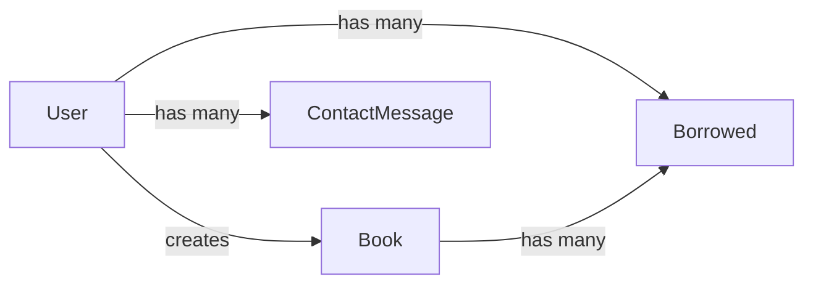

| Relationship | Type | Details |
|---|---|---|
| User → Borrowed | One-to-Many | A user can have many borrow records |
| Book → Borrowed | One-to-Many | A book can have many borrow records |
| User → ContactMessage | One-to-Many | A user can submit many messages |
| User → Book (createdBy) | One-to-Many | An admin can create many books |

---

## 8. API Documentation

**Base URL:** `http://localhost:3000/api`  
**Authentication:** JWT Bearer Token in `Authorization` header  
**Content-Type:** `application/json`

---

### 8.1 Authentication Endpoints

#### POST `/auth/register`

**Description:** Register a new student account. Role is always set to `"student"`.  
**Authentication:** Public  

**Request Body:**
```json
{
  "fullName": "Ahmed Hassan",
  "email": "ahmed@eelu.edu.eg",
  "password": "securePass123",
  "faculty": "IT",
  "academicYear": "Year 2"
}
```

**Success Response (201):**
```json
{
  "success": true,
  "message": "Registration successful",
  "token": "eyJhbGciOiJIUzI1NiIsInR5cCI6IkpXVCJ9...",
  "user": {
    "_id": "648abc123def456",
    "fullName": "Ahmed Hassan",
    "email": "ahmed@eelu.edu.eg",
    "faculty": "IT",
    "academicYear": "Year 2",
    "role": "student"
  }
}
```

**Error Responses:**

| Status | Code | Message |
|---|---|---|
| 400 | Bad Request | Validation error (e.g. "Password must be at least 8 characters") |
| 409 | Conflict | "Email already registered" |

---

#### POST `/auth/login`

**Description:** Authenticate user and receive JWT token.  
**Authentication:** Public

**Request Body:**
```json
{
  "email": "ahmed@eelu.edu.eg",
  "password": "securePass123"
}
```

**Success Response (200):**
```json
{
  "success": true,
  "message": "Login successful",
  "token": "eyJhbGciOiJIUzI1NiIsInR5cCI6IkpXVCJ9...",
  "user": {
    "_id": "648abc123def456",
    "fullName": "Ahmed Hassan",
    "email": "ahmed@eelu.edu.eg",
    "faculty": "IT",
    "academicYear": "Year 2",
    "role": "student",
    "isActive": true
  }
}
```

**Error Responses:**

| Status | Message |
|---|---|
| 400 | "Invalid email or password" |
| 403 | "Your account has been deactivated" |

---

#### GET `/auth/me`

**Description:** Get the authenticated user's profile.  
**Authentication:** JWT Required

**Success Response (200):**
```json
{
  "success": true,
  "data": {
    "_id": "648abc123def456",
    "fullName": "Ahmed Hassan",
    "email": "ahmed@eelu.edu.eg",
    "faculty": "IT",
    "academicYear": "Year 2",
    "role": "student",
    "isActive": true
  }
}
```

---

#### PUT `/auth/me`

**Description:** Update authenticated user's profile.  
**Authentication:** JWT Required

**Request Body:**
```json
{
  "fullName": "Ahmed Hassan Ali",
  "faculty": "IT",
  "academicYear": "Year 3"
}
```

**Success Response (200):**
```json
{
  "success": true,
  "message": "Profile updated successfully",
  "data": { "...updated user object..." }
}
```

---

#### PUT `/auth/change-password`

**Description:** Change authenticated user's password.  
**Authentication:** JWT Required

**Request Body:**
```json
{
  "currentPassword": "oldPass123",
  "newPassword": "newSecurePass456"
}
```

**Success Response (200):**
```json
{
  "success": true,
  "message": "Password changed successfully"
}
```

**Error Responses:**

| Status | Message |
|---|---|
| 400 | "Current password is incorrect" |
| 400 | "New password must be at least 8 characters" |

---

### 8.2 Books Endpoints

#### GET `/books`

**Description:** Retrieve all active books with optional filters.  
**Authentication:** Public

**Query Parameters:**

| Parameter | Type | Description |
|---|---|---|
| `q` | string | Text search in title, author, category, description |
| `faculty` | string | Filter by `"IT"` or `"BA"` |
| `academicYear` / `year` | string | Filter by e.g. `"Year 2"` |
| `category` | string | Filter by category (partial match) |
| `includeInactive` | boolean | `"true"` to include archived books |

**Success Response (200):**
```json
{
  "success": true,
  "total": 42,
  "data": [
    {
      "_id": "648bcd234ef567",
      "title": "Introduction to Algorithms",
      "author": "Thomas H. Cormen",
      "category": "Algorithms",
      "faculty": "IT",
      "academicYear": "Year 4",
      "description": "A comprehensive introduction to algorithms...",
      "coverImageUrl": "https://...",
      "pdfUrl": "https://...",
      "totalCopies": 10,
      "availableCopies": 7,
      "isActive": true,
      "createdAt": "2026-06-01T10:00:00.000Z"
    }
  ]
}
```

---

#### GET `/books/:id`

**Description:** Get a single book by its MongoDB ObjectId.  
**Authentication:** Public

**Success Response (200):**
```json
{
  "success": true,
  "data": { "...full book object..." }
}
```

**Error Responses:**

| Status | Message |
|---|---|
| 400 | "Invalid book id" |
| 404 | "Book not found" |

---

#### POST `/books`

**Description:** Create a new book in the catalogue.  
**Authentication:** JWT + Admin

**Request Body:**
```json
{
  "title": "Database System Concepts",
  "author": "Abraham Silberschatz",
  "category": "Database Systems",
  "faculty": "IT",
  "academicYear": "Year 2",
  "description": "A comprehensive textbook on database systems...",
  "coverImageUrl": "https://example.com/cover.jpg",
  "pdfUrl": "https://example.com/book.pdf",
  "totalCopies": 12,
  "availableCopies": 12
}
```

**Success Response (201):**
```json
{
  "success": true,
  "message": "Book created successfully",
  "data": { "...created book object..." }
}
```

---

#### PUT `/books/:id`

**Description:** Update an existing book's fields.  
**Authentication:** JWT + Admin

**Request Body:** Any subset of book fields.

**Success Response (200):**
```json
{
  "success": true,
  "message": "Book updated successfully",
  "data": { "...updated book object..." }
}
```

---

#### DELETE `/books/:id`

**Description:** Soft-delete a book (sets `isActive: false`).  
**Authentication:** JWT + Admin

**Success Response (200):**
```json
{
  "success": true,
  "message": "Book archived successfully",
  "data": { "...book object with isActive: false..." }
}
```

---

#### PATCH `/books/:id/toggle-status`

**Description:** Toggle a book's `isActive` status between active and archived.  
**Authentication:** JWT + Admin

**Success Response (200):**
```json
{
  "success": true,
  "message": "Book activated successfully",
  "data": { "...book object..." }
}
```

---

### 8.3 Borrowed Endpoints

#### POST `/borrowed`

**Description:** Borrow an available book. Atomically decrements `availableCopies`.  
**Authentication:** JWT Required

**Request Body:**
```json
{
  "bookId": "648bcd234ef567"
}
```

**Success Response (201):**
```json
{
  "success": true,
  "message": "Book borrowed successfully",
  "data": {
    "_id": "648cde345fg678",
    "userId": "648abc123def456",
    "bookId": "648bcd234ef567",
    "status": "borrowed",
    "borrowDate": "2026-06-13T09:00:00.000Z",
    "dueDate": "2026-06-27T09:00:00.000Z"
  }
}
```

**Error Responses:**

| Status | Message |
|---|---|
| 400 | "No copies available" |
| 404 | "Book not found" |

---

#### POST `/borrowed/reserve`

**Description:** Reserve a book that has no available copies.  
**Authentication:** JWT Required

**Request Body:**
```json
{
  "bookId": "648bcd234ef567"
}
```

**Success Response (201):**
```json
{
  "success": true,
  "message": "Book reserved successfully",
  "data": {
    "status": "reserved",
    "...other fields..."
  }
}
```

---

#### GET `/borrowed/my`

**Description:** Get the authenticated student's borrow history with computed fields.  
**Authentication:** JWT Required

**Success Response (200):**
```json
{
  "success": true,
  "data": [
    {
      "_id": "648cde345fg678",
      "bookId": {
        "_id": "648bcd234ef567",
        "title": "Introduction to Algorithms",
        "author": "Thomas H. Cormen",
        "coverImageUrl": "https://..."
      },
      "status": "borrowed",
      "borrowDate": "2026-06-13T09:00:00.000Z",
      "dueDate": "2026-06-27T09:00:00.000Z",
      "borrowedDays": 14,
      "isOverdue": false
    }
  ]
}
```

---

#### GET `/borrowed/admin/all`

**Description:** Get all borrow records across all users. Supports `?status=` filter.  
**Authentication:** JWT + Admin

**Query Parameters:**

| Parameter | Values |
|---|---|
| `status` | `borrowed`, `reserved`, `returned`, `cancelled` |

---

#### PUT `/borrowed/:id/return`

**Description:** Mark a borrowed book as returned. Atomically increments `availableCopies`.  
**Authentication:** JWT Required (own records) / Admin (any record)

**Success Response (200):**
```json
{
  "success": true,
  "message": "Book returned successfully",
  "data": {
    "status": "returned",
    "returnDate": "2026-06-20T14:30:00.000Z",
    "...other fields..."
  }
}
```

---

#### PUT `/borrowed/:id/cancel`

**Description:** Cancel a reservation.  
**Authentication:** JWT Required (own records) / Admin (any record)

**Success Response (200):**
```json
{
  "success": true,
  "message": "Reservation cancelled successfully"
}
```

---

### 8.4 Admin Endpoints

#### GET `/admin/dashboard`

**Description:** Retrieve summary statistics for the admin dashboard.  
**Authentication:** JWT + Admin

**Success Response (200):**
```json
{
  "success": true,
  "data": {
    "users": 156,
    "books": 342,
    "borrowed": 89,
    "borrowedActive": 67,
    "reserved": 22,
    "returned": 410,
    "overdue": 5,
    "contacts": 12
  }
}
```

---

#### GET `/admin/users`

**Description:** Get all registered user accounts (no password fields).  
**Authentication:** JWT + Admin

---

#### PATCH `/admin/users/:id/role`

**Description:** Change a user's role.  
**Authentication:** JWT + Admin

**Request Body:**
```json
{
  "role": "admin"
}
```

---

#### PATCH `/admin/users/:id/status`

**Description:** Toggle a user's `isActive` status.  
**Authentication:** JWT + Admin

---

#### GET `/admin/books`

**Description:** Get all books including archived (`isActive: false`).  
**Authentication:** JWT + Admin

---

#### GET `/admin/library-stats`

**Description:** Aggregated statistics — books grouped by faculty and by active/inactive status.  
**Authentication:** JWT + Admin

**Success Response (200):**
```json
{
  "success": true,
  "data": {
    "booksByFaculty": [
      { "_id": "IT", "count": 210 },
      { "_id": "BA", "count": 132 }
    ],
    "booksByStatus": [
      { "_id": true, "count": 320 },
      { "_id": false, "count": 22 }
    ]
  }
}
```

---

#### GET `/admin/messages`

**Description:** Get all contact messages, populated with submitter details.  
**Authentication:** JWT + Admin

---

#### PUT `/admin/messages/:id/status`

**Description:** Update a contact message's lifecycle status.  
**Authentication:** JWT + Admin

**Request Body:**
```json
{
  "status": "read"
}
```

---

#### DELETE `/admin/messages/:id`

**Description:** Permanently delete a contact message.  
**Authentication:** JWT + Admin

---

### 8.5 Contact Endpoints

#### POST `/contact`

**Description:** Submit a contact/support message.  
**Authentication:** JWT Required

**Request Body:**
```json
{
  "name": "Ahmed Hassan",
  "email": "ahmed@eelu.edu.eg",
  "subject": "Book not available",
  "message": "I have been trying to borrow this book for two weeks..."
}
```

**Success Response (201):**
```json
{
  "success": true,
  "message": "Message sent successfully"
}
```

---

### 8.6 Standard Error Response Format

All errors follow this structure:

```json
{
  "success": false,
  "message": "Human-readable error description",
  "errors": ["Field-level errors array (validation only)"]
}
```

| HTTP Status | Meaning |
|---|---|
| 400 | Bad Request — validation failure or business rule violation |
| 401 | Unauthorised — missing or invalid JWT token |
| 403 | Forbidden — authenticated but insufficient permissions |
| 404 | Not Found — resource does not exist |
| 500 | Internal Server Error — unexpected server-side failure |

---

## 9. Use Case Analysis

### 9.1 Actors

| Actor | Description |
|---|---|
| **Guest** | Unauthenticated visitor; can only view public book listings |
| **Student** | Authenticated user with `role: "student"`; primary end-user |
| **Administrator** | Authenticated user with `role: "admin"`; manages all content and users |
| **System** | Automated system actions (e.g. overdue detection, token expiry) |

### 9.2 Use Case Diagram

```mermaid
graph TD
    Guest([Guest])
    Student([Student])
    Admin([Administrator])
    System([System])

    Guest --> UC1[View Book Catalogue]
    Guest --> UC2[Register Account]
    Guest --> UC3[Login]

    Student --> UC1
    Student --> UC4[Search & Filter Books]
    Student --> UC5[View Book Details]
    Student --> UC6[Borrow Book]
    Student --> UC7[Reserve Book]
    Student --> UC8[Return Book]
    Student --> UC9[Cancel Reservation]
    Student --> UC10[View My Loans]
    Student --> UC11[Submit Contact Message]
    Student --> UC12[Manage Accessibility Settings]
    Student --> UC13[Update Profile]

    Admin --> UC1
    Admin --> UC14[Add Book]
    Admin --> UC15[Edit Book]
    Admin --> UC16[Archive/Restore Book]
    Admin --> UC17[View All Users]
    Admin --> UC18[Change User Role]
    Admin --> UC19[Activate/Deactivate User]
    Admin --> UC20[View All Loans]
    Admin --> UC21[Process Return]
    Admin --> UC22[Manage Contact Messages]
    Admin --> UC23[View Dashboard Statistics]

    System --> UC24[Detect Overdue Loans]
    System --> UC25[Expire JWT Token]
```

### 9.3 Use Case Descriptions

---

#### UC-01: User Registration

| Attribute | Detail |
|---|---|
| **Use Case ID** | UC-01 |
| **Name** | User Registration |
| **Actor** | Guest |
| **Precondition** | User is not authenticated; has a valid email address |
| **Postcondition** | New student account created; user is authenticated |
| **Main Flow** | 1. User navigates to `register.html` <br> 2. User fills in: Full Name, Email, Password, Faculty, Academic Year <br> 3. System validates all fields (email format, password ≥ 8 chars) <br> 4. System checks email uniqueness <br> 5. System hashes password with bcrypt <br> 6. System creates user record with `role: "student"` <br> 7. System returns JWT token and user object <br> 8. Frontend stores token in localStorage <br> 9. Frontend redirects to `login.html` |
| **Alternative Flow** | 3a. Validation fails → display field-level error messages <br> 4a. Email already exists → display "Email already registered" |

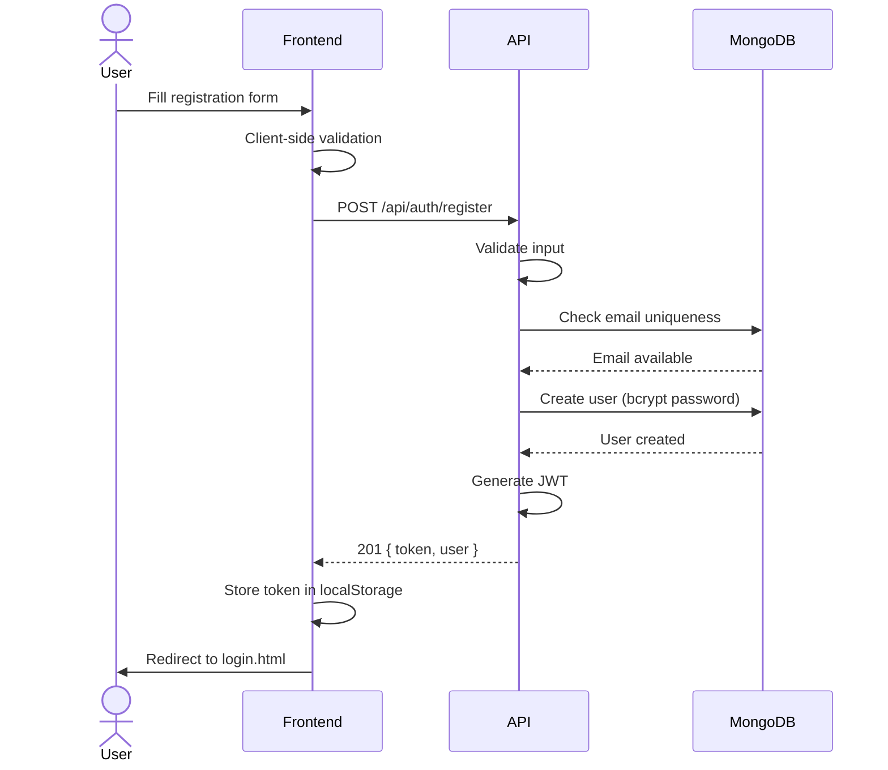

---

#### UC-02: User Login

| Attribute | Detail |
|---|---|
| **Use Case ID** | UC-02 |
| **Name** | User Login |
| **Actor** | Guest |
| **Precondition** | User has a registered, active account |
| **Postcondition** | User is authenticated with a valid JWT token |
| **Main Flow** | 1. User navigates to `login.html` <br> 2. User enters email and password <br> 3. Frontend sends POST `/api/auth/login` <br> 4. Backend validates credentials <br> 5. Backend checks `isActive` flag <br> 6. Backend compares password with bcrypt <br> 7. Backend generates JWT (payload: `{ id, role }`) <br> 8. Frontend stores token + user data in localStorage <br> 9. Frontend redirects: admin → `/dashboard`, student → `search.html` |
| **Alternative Flow** | 4a. Invalid credentials → "Invalid email or password" <br> 5a. Account deactivated → "Your account has been deactivated" |

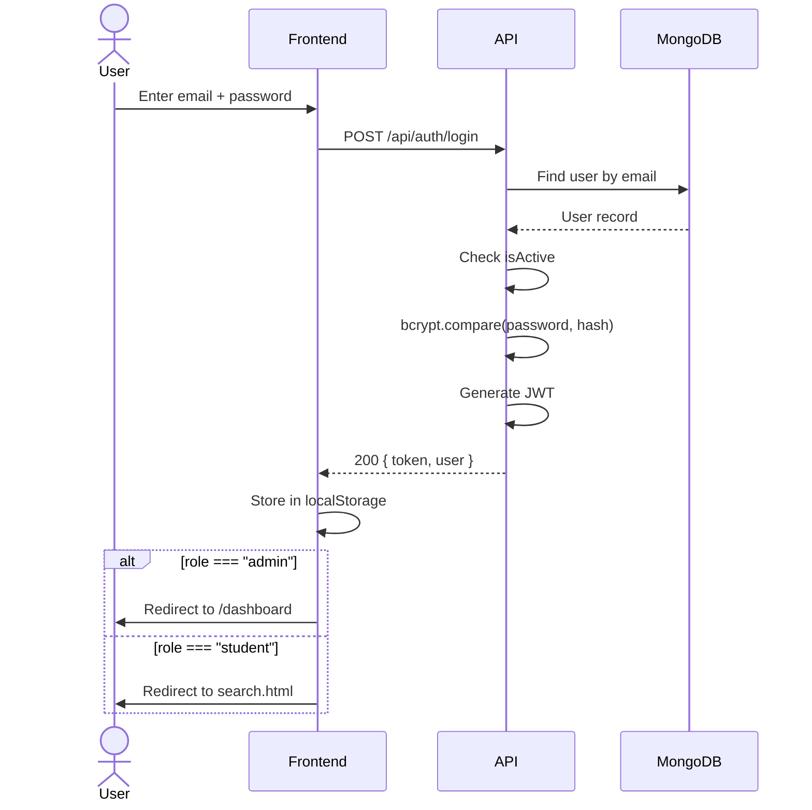

---

#### UC-03: Search Books

| Attribute | Detail |
|---|---|
| **Use Case ID** | UC-03 |
| **Name** | Search and Filter Books |
| **Actor** | Student |
| **Precondition** | User is authenticated |
| **Postcondition** | Filtered book list displayed to user |
| **Main Flow** | 1. User navigates to `search.html` <br> 2. System loads all active books from `GET /api/books` <br> 3. User enters search term and/or applies filters (faculty, year, category) <br> 4. Frontend applies client-side filtering in real-time <br> 5. Matching books are displayed as cards with availability status |
| **URL Parameter Flow** | 1a. User arrives with `?faculty=IT` query parameter <br> 2a. System pre-selects Faculty filter after books load <br> 3a. Filtered results displayed automatically |

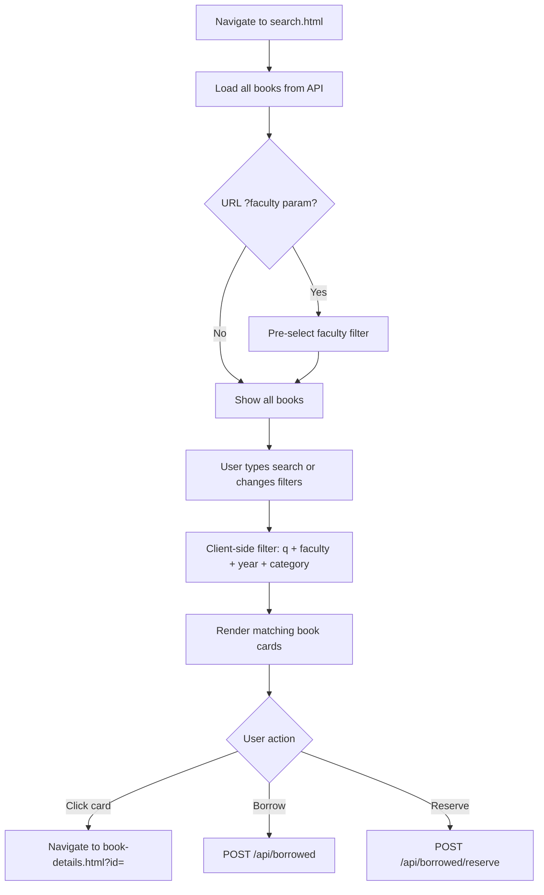

---

#### UC-04: Borrow Book

| Attribute | Detail |
|---|---|
| **Use Case ID** | UC-04 |
| **Name** | Borrow Book |
| **Actor** | Student |
| **Precondition** | User is authenticated; book `availableCopies > 0` |
| **Postcondition** | Loan record created; `availableCopies` decremented by 1 |
| **Main Flow** | 1. Student views a book with available copies <br> 2. Student clicks "Borrow Book" <br> 3. Frontend sends POST `/api/borrowed` with `{ bookId }` <br> 4. Backend starts MongoDB transaction <br> 5. Backend verifies `availableCopies > 0` <br> 6. Backend creates `Borrowed` record with `status: "borrowed"`, `dueDate = now + 14 days` <br> 7. Backend decrements `availableCopies` <br> 8. Transaction committed <br> 9. Frontend redirects to `my-borrowed.html` |
| **Alternative Flow** | 5a. No copies available → 400 "No copies available" <br> 5b. Transaction fails → rolled back, 500 error |

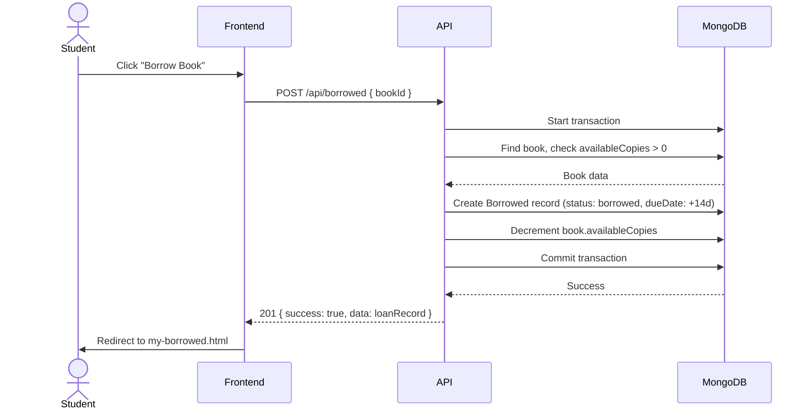

---

#### UC-05: Return Book

| Attribute | Detail |
|---|---|
| **Use Case ID** | UC-05 |
| **Name** | Return Book |
| **Actor** | Student / Administrator |
| **Precondition** | Loan record exists with `status: "borrowed"` |
| **Postcondition** | Loan status set to `"returned"`; `availableCopies` incremented by 1 |
| **Main Flow** | 1. Student navigates to `my-borrowed.html` <br> 2. Student clicks "Return Book" on an active loan <br> 3. Frontend sends PUT `/api/borrowed/:id/return` <br> 4. Backend starts MongoDB transaction <br> 5. Backend verifies loan belongs to user (or requester is admin) <br> 6. Backend updates loan: `status: "returned"`, `returnDate: now` <br> 7. Backend increments `availableCopies` <br> 8. Transaction committed <br> 9. Frontend refreshes loan list |

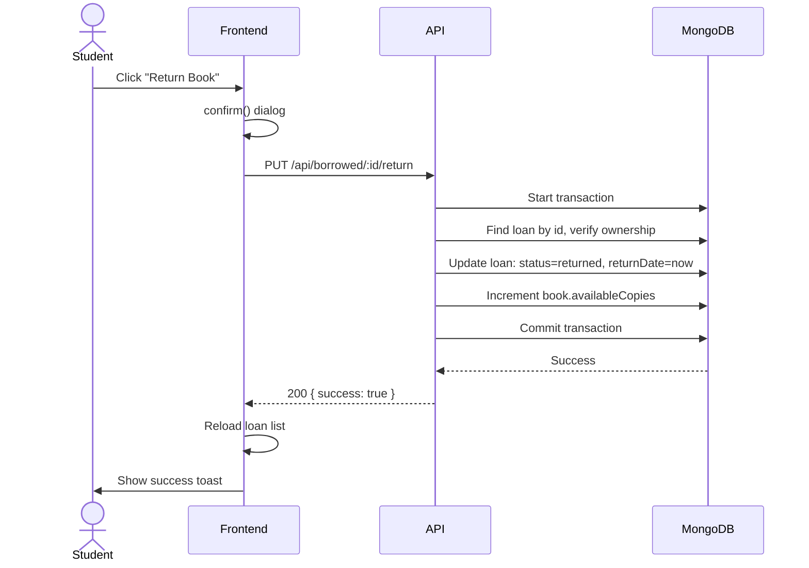

---

#### UC-06: Reserve Book

| Attribute | Detail |
|---|---|
| **Use Case ID** | UC-06 |
| **Name** | Reserve Book |
| **Actor** | Student |
| **Precondition** | User is authenticated; book `availableCopies == 0` |
| **Postcondition** | Reservation record created; copy count unchanged |
| **Main Flow** | 1. Student views a book with no available copies <br> 2. "Borrow Book" button is replaced with "Reserve" <br> 3. Student clicks "Reserve" <br> 4. Frontend sends POST `/api/borrowed/reserve` with `{ bookId }` <br> 5. Backend creates Borrowed record with `status: "reserved"` (no copy decrement) <br> 6. Frontend redirects to `my-borrowed.html` |

---

### 9.4 Workflow Diagrams

#### Overall System Workflow

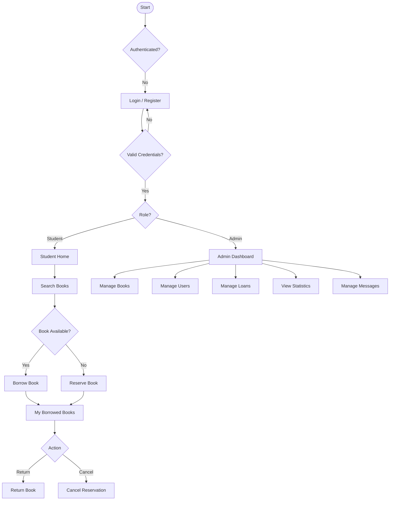

#### Loan Lifecycle State Machine

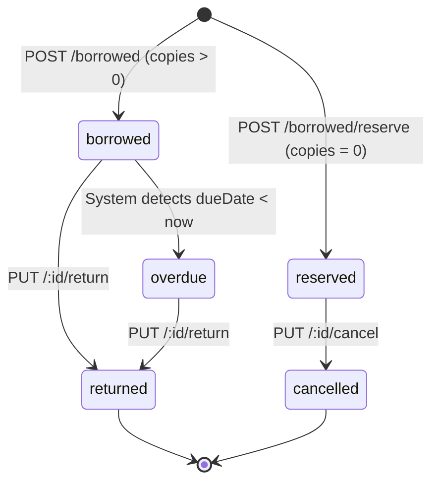

---

## 10. Security and Privacy Considerations

### 10.1 Authentication Security

- **Password Storage:** All passwords are hashed using **bcrypt** before storage. The `password` field is excluded from all query results by default (`select: false`) to prevent accidental exposure.
- **JWT Tokens:** Tokens contain only `{ id, role }` — no sensitive user data. Tokens are signed with `JWT_SECRET` and expire in `JWT_EXPIRES_IN` (default 1 day).
- **Token Transmission:** Tokens are sent in the `Authorization: Bearer <token>` header, not in query strings or cookies.

### 10.2 Authorisation Security

- **Role-Based Access Control:** Every admin-protected endpoint passes through `adminOnly` middleware. Skipping authentication is not possible due to middleware chain order.
- **Resource Ownership:** The borrowing controller verifies that a student can only modify their own records (return/cancel). Admins can act on any record.
- **Account Status Check:** The `protect` middleware checks `isActive` on every request — deactivated users are blocked even with a valid token.

### 10.3 Input Validation & Injection Prevention

- All user inputs pass through `validators.js` before reaching controllers.
- Mongoose schemas enforce type validation, maximum lengths, and enum values.
- ObjectId parameters are validated with `isValidObjectId()` before database queries.
- Request bodies are limited to **10KB** to mitigate oversized payload attacks.
- The `validator` library is used for email format validation.

### 10.4 HTTP Security Headers

Helmet middleware automatically sets:
- `X-Frame-Options: DENY` — prevents clickjacking
- `X-Content-Type-Options: nosniff` — prevents MIME sniffing
- `Strict-Transport-Security` — enforces HTTPS (production)
- `Content-Security-Policy` — restricts resource loading origins
- `X-Powered-By` header is explicitly disabled

### 10.5 CORS Policy

Cross-Origin Resource Sharing is restricted to origins configured in the `CORS_ORIGIN` environment variable. Unrecognised origins are blocked.

### 10.6 Data Privacy

- Student email addresses and full names are stored but never exposed in public API responses.
- Contact message submitter identity (`submittedBy`) is populated only in admin responses.
- No third-party analytics, tracking scripts, or external data-sharing mechanisms are implemented.
- The `db.json` file (if used for seeding) should not be committed to version control as it may contain real user credentials.

### 10.7 Frontend Security

- Auth guards on every protected page redirect unauthenticated users to `login.html` before any API call.
- The admin dashboard verifies `role === "admin"` client-side after login and server-side on every admin API request.
- `localStorage` is used for token storage — XSS mitigations (input sanitisation, `escHtml()` utility) are applied throughout the frontend.

---

## 11. Frontend Structure

### 11.1 Pages

| Page | File | Auth Required | Description |
|---|---|---|---|
| Landing | `index.html` | No | Page navigator / project index |
| Login | `login.html` | No | Student and admin login form |
| Register | `register.html` | No | New student account creation |
| Home | `combined.html` | Student | Welcome dashboard with stats, about section, faculty browse |
| Search | `search.html` | Student | Full book catalogue with real-time filters |
| Book Details | `book-details.html` | Student | Single book page with borrow/reserve/details |
| My Books | `my-borrowed.html` | Student | Personal loan tracker with return/cancel actions |
| Accessibility | `accessibility.html` | Student | Font size, contrast, screen reader, shortcuts |
| Contact | `contact.html` | Student | Contact form and support information |

### 11.2 Shared Components

| Component | File | Used In |
|---|---|---|
| Mobile Navigation Sidebar | `accessibility-init.js` | All pages |
| Font Size Restoration | `accessibility-init.js` | All pages |
| High-Contrast Mode | `accessibility-init.js` | All pages |
| Navigation Links | HTML (repeated in each page) | All pages except index |
| Bootstrap Toast Notifications | Inline in each `.js` file | search, my-borrowed, contact, book-details |
| Auth Guard | Inline in each `.js` file | All protected pages |

### 11.3 Navigation Flow

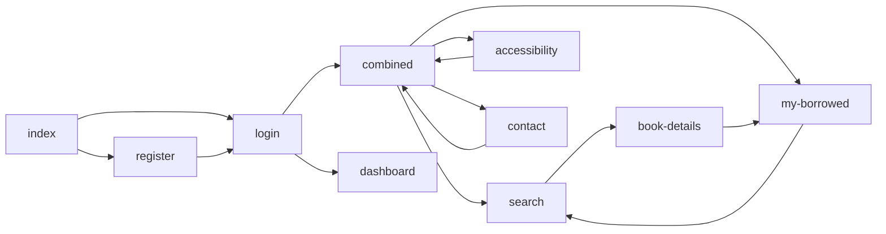

### 11.4 Accessibility Module

The accessibility system is the most architecturally significant frontend feature. It operates as follows:

1. **`accessibility-init.js`** runs on every page via `<script src="accessibility-init.js">` before the page-specific script.
2. It reads `localStorage` and immediately applies saved preferences (font size, high-contrast) before the DOM is painted, preventing flash of unstyled content.
3. It dynamically builds the mobile sidebar, injecting the sidebar header (with close button), user info block, and overlay — so the HTML of every page stays clean.
4. **`accessibility.js`** (only on `accessibility.html`) provides the interactive UI for adjusting settings, which are persisted back to `localStorage` and picked up by `accessibility-init.js` on subsequent pages.

---

## 12. Backend Structure

### 12.1 Controllers

| Controller | File | Responsibilities |
|---|---|---|
| Auth Controller | `authController.js` | register, login, getMe, updateMe, changePassword |
| Book Controller | `bookController.js` | getBooks, getBookById, addBook, updateBook, deleteBook, toggleBookStatus |
| Borrowed Controller | `borrowedController.js` | borrowBook, reserveBook, getBorrowed, getAllBorrowed, getBorrowedStats, returnBook, cancelReservation |
| Admin Controller | `adminController.js` | getDashboard, getUsers, updateUserRole, toggleUserStatus, getAdminBooks, getLibraryStats, getMessages, updateMessageStatus, deleteMessage |
| Contact Controller | `contactController.js` | submitMessage, getMessages, updateMessageStatus, deleteMessage |

### 12.2 Routes

| Router | Mount Path | File |
|---|---|---|
| Auth Router | `/api/auth` | `authRoutes.js` |
| Book Router | `/api/books` | `bookRoutes.js` |
| Borrow Router | `/api/borrowed` | `borrowRoutes.js` |
| Admin Router | `/api/admin` | `adminRoutes.js` |
| Contact Router | `/api/contact` | `contactRoutes.js` |

### 12.3 Middleware

| Middleware | File | Purpose |
|---|---|---|
| `protect` | `authMiddleware.js` | Verify JWT, load `req.user`, block inactive accounts |
| `adminOnly` | `adminMiddleware.js` | Block non-admin users with 403 |
| `notFound` | `errorMiddleware.js` | Catch unmatched routes, return 404 |
| `errorHandler` | `errorMiddleware.js` | Global error catch, hide stack in production |
| `validateRegister` | `validators.js` | Validate registration inputs |
| `validateLogin` | `validators.js` | Validate login inputs |
| `validateBook` | `validators.js` | Validate book create/update inputs |
| `validateContact` | `validators.js` | Validate contact form inputs |
| `isValidObjectId` | `validators.js` | Check MongoDB ObjectId format |

### 12.4 Models

| Model | File | Collection |
|---|---|---|
| User | `User.js` | `users` |
| Book | `Book.js` | `books` |
| Borrowed | `Borrowed.js` | `borroweds` |
| ContactMessage | `ContactMessage.js` | `contactmessages` |

### 12.5 Utility Services

| Utility | File | Purpose |
|---|---|---|
| Token Generator | `utils/generateToken.js` | Wraps `jwt.sign()` with standard options |
| DB Connection | `config/db.js` | `mongoose.connect()` with retry logic |

### 12.6 Server Bootstrap Sequence

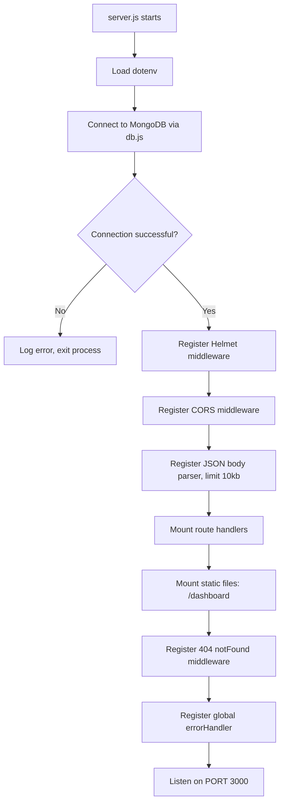

---

## 13. Assumptions and Constraints

### 13.1 Assumptions

1. All users have access to a modern web browser supporting ES6+ JavaScript.
2. Students have valid university-domain email addresses, but the system does not currently enforce a domain restriction.
3. MongoDB is available either locally or via MongoDB Atlas at the URI specified in `.env`.
4. Network connectivity is available; the system does not support offline operation.
5. The system is deployed on a server accessible to all EELU students; no VPN or special network configuration is required.
6. A single MongoDB replica set (or standalone instance) is sufficient for the transaction requirements of the borrowing workflow.

### 13.2 Constraints

| Constraint | Description |
|---|---|
| **Language** | Backend: Node.js/JavaScript only; no TypeScript |
| **Database** | MongoDB only; no relational database support |
| **Authentication** | JWT only; no OAuth, SSO, or session-based auth |
| **File Storage** | No file upload capability; cover images and PDFs must be external URLs |
| **Email Notifications** | No email sending service is integrated |
| **Two Faculties** | The system is designed for IT and BA faculties only |
| **Role Limit** | Only two roles: `student` and `admin`; no intermediate roles |
| **Body Limit** | Request bodies are hard-limited to 10KB |
| **Single Server** | No built-in load balancing or clustering |

---

## 14. Future Enhancements

The following enhancements are identified as high-value improvements for subsequent development iterations:

### 14.1 Short-Term (Next Release)

| Enhancement | Description |
|---|---|
| **Email Notifications** | Send automated emails for: successful registration, loan confirmation, due-date reminders (3 days before), overdue alerts |
| **Domain Validation** | Enforce `@eelu.edu.eg` email domain during registration |
| **Overdue Fine System** | Track and display calculated fines for overdue books |
| **Book Ratings & Reviews** | Allow students to rate and review borrowed books |
| **Pagination** | Implement server-side pagination for book listing and admin tables |

### 14.2 Medium-Term

| Enhancement | Description |
|---|---|
| **PDF Viewer** | Embed an in-browser PDF viewer (PDF.js) for books with `pdfUrl` |
| **Notification Centre** | In-app notification bell for due dates, available reservations, etc. |
| **Advanced Search** | Elasticsearch integration for full-text search with ranking |
| **Bulk Import** | Admin CSV upload for bulk book catalogue import |
| **Activity Log** | Audit trail for all admin actions |

### 14.3 Long-Term

| Enhancement | Description |
|---|---|
| **Mobile Application** | React Native or Flutter app for iOS and Android |
| **LMS Integration** | API integration with EELU's existing Learning Management System |
| **Recommendation Engine** | AI-powered book recommendations based on faculty, year, and borrowing history |
| **Multi-Institution Support** | Multi-tenancy to serve multiple university branches |
| **RFID/Barcode Integration** | Physical library barcode scanning for hybrid digital-physical operations |
| **TypeScript Migration** | Migrate backend to TypeScript for improved type safety and maintainability |

---

## Appendix A: Glossary

| Term | Definition |
|---|---|
| **EELU** | Egyptian E-Learning University |
| **JWT** | JSON Web Token — a compact, self-contained method for securely transmitting information as a JSON object |
| **bcrypt** | A password hashing function designed to be computationally expensive to resist brute-force attacks |
| **Soft Delete** | Marking a record as inactive rather than physically removing it from the database |
| **ODM** | Object-Document Mapper — library that maps MongoDB documents to JavaScript objects (Mongoose) |
| **SPA** | Single-Page Application — web application that dynamically rewrites the current page |
| **MPA** | Multi-Page Application — traditional web architecture where each page is a separate HTML document |
| **CORS** | Cross-Origin Resource Sharing — mechanism to allow or restrict web application requests from different origins |
| **ARIA** | Accessible Rich Internet Applications — set of attributes defining ways to make web content accessible |
| **WCAG** | Web Content Accessibility Guidelines |
| **IT Faculty** | Information Technology Faculty at EELU |
| **BA Faculty** | Business Administration Faculty at EELU |

---

## Appendix B: Environment Configuration

The backend requires the following environment variables in `backend/.env`:

| Variable | Required | Default | Description |
|---|---|---|---|
| `MONGO_URI` | ✅ | — | Full MongoDB connection string |
| `JWT_SECRET` | ✅ | — | Secret key for JWT signing (min 32 chars recommended) |
| `JWT_EXPIRES_IN` | — | `"1d"` | Token expiry duration (e.g. `"1d"`, `"7d"`, `"2h"`) |
| `PORT` | — | `3000` | HTTP server port |
| `CORS_ORIGIN` | — | `*` | Comma-separated list of allowed origins |
| `NODE_ENV` | — | `development` | Set to `production` to hide error stack traces |

---

*End of Document — EELU Library Hub Software Engineering Documentation v1.0*
