# EELU Library Hub
## Software Engineering Documentation Package
### Egyptian E-Learning University — Graduation Project

---

> **Document Version:** 1.1  
> **Date:** June 2026  
> **Classification:** Academic / University Graduation Project  
> **Repository:** `eelu-library-hub`

---

## Table of Contents

1. [Project Overview](#1-project-overview)
2. [System Architecture](#2-system-architecture)
3. [Functional Requirements](#3-functional-requirements)
4. [Non-Functional Requirements](#4-non-functional-requirements)
5. [User Roles and Permissions](#5-user-roles-and-permissions)
6. [Database Design](#6-database-design)
7. [API Documentation](#7-api-documentation)
8. [Use Case Analysis](#8-use-case-analysis)
9. [Workflow Diagrams](#9-workflow-diagrams)
10. [Security and Privacy Considerations](#10-security-and-privacy-considerations)
11. [Frontend Structure](#11-frontend-structure)
12. [Backend Structure](#12-backend-structure)
13. [Assumptions and Constraints](#13-assumptions-and-constraints)
14. [Future Enhancements](#14-future-enhancements)

---

## 1. Project Overview

### 1.1 Purpose

The **EELU Library Hub** is a full-stack digital library management system developed for the **Egyptian E-Learning University (EELU)**. The system provides a centralised platform that enables students to discover, borrow, reserve, and manage academic books online, while equipping administrators with comprehensive tools to manage the library catalogue, user accounts, and loan transactions.

The platform is designed with an inclusive philosophy, incorporating a dedicated accessibility layer that supports users with visual impairments, mobility limitations, and other special needs — a core commitment of EELU's e-learning model.

### 1.2 Objectives

The primary objectives of the EELU Library Hub are:

1. **Digitise library operations** by replacing manual borrowing registers with an automated, real-time system.
2. **Improve academic resource access** by enabling students to search, filter, and access library materials from any device.
3. **Enforce institutional access control** through role-based authentication ensuring only registered EELU students and verified administrators may interact with protected features.
4. **Support inclusive education** through a built-in accessibility module covering font-size adjustment, high-contrast mode, screen-reader support, and keyboard shortcuts.
5. **Provide administrative oversight** via a dedicated admin dashboard with real-time statistics, full book CRUD management, user lifecycle management, and loan tracking.
6. **Facilitate student–library communication** through an integrated contact and support request system.

### 1.3 Scope

**In Scope:**

| Area | Capabilities |
|---|---|
| Authentication | Student registration, login, profile update, password change |
| Catalogue | Book listing, search, filtering, detail views, admin CRUD |
| Loans | Borrow, reserve, return, cancel reservation, overdue detection |
| Administration | Dashboard, user management, loan oversight, contact messages |
| Accessibility | Font size, high contrast, screen reader, keyboard shortcuts |
| UI/UX | Responsive student MPA and admin SPA dashboard |

**Out of Scope:**

- Physical library barcode scanning or RFID integration
- Payment gateway for library fines
- Email notification system (e.g., due-date reminders)
- Integration with EELU's existing LMS or student information system
- Mobile native applications (iOS/Android)
- File upload for book covers or PDFs (external URLs only)

### 1.4 Problem Statement

Egyptian E-Learning University operates a distributed student body learning entirely online. Traditional physical library access is inherently incompatible with an e-learning model. Students lack a unified digital interface to:

- Discover what academic resources are available for their specific faculty and academic year.
- Reserve or borrow books without physical presence.
- Track their loan status, due dates, and overdue items.

Simultaneously, library administrators manage catalogues, track copies, and handle student enquiries through disconnected and often manual processes. The absence of a unified digital library system creates friction in academic resource access, increases administrative overhead, and excludes students with accessibility needs from equitable participation.

The **EELU Library Hub** addresses these pain points through a coherent, secure, and accessible web-based platform.

---

## 2. System Architecture

### 2.1 High-Level Architecture

The system follows a classic **three-tier architecture** pattern separating presentation, application logic, and data persistence.

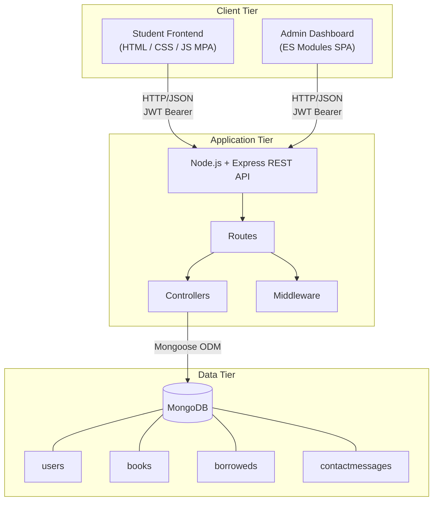
```mermaid
flowchart TB
    subgraph Client["Client Tier"]
        SF["Student Frontend<br/>(HTML / CSS / JS MPA)"]
        AD["Admin Dashboard<br/>(ES Modules SPA)"]
    end

    subgraph App["Application Tier"]
        API["Node.js + Express REST API"]
        R["Routes"]
        C["Controllers"]
        M["Middleware"]
        API --> R --> C
        R --> M
    end

    subgraph Data["Data Tier"]
        DB[("MongoDB")]
        U["users"]
        B["books"]
        BR["borroweds"]
        CM["contactmessages"]
        DB --- U & B & BR & CM
    end

    SF -->|"HTTP/JSON<br/>JWT Bearer"| API
    AD -->|"HTTP/JSON<br/>JWT Bearer"| API
    C -->|"Mongoose ODM"| DB
```

**Communication model:** Stateless REST over HTTP with JSON payloads. Protected resources require a JWT sent in the `Authorization: Bearer <token>` header.

### 2.2 Frontend Architecture

The student-facing frontend is a **Multi-Page Application (MPA)** built with HTML5, CSS3, Bootstrap 5.3.3, Bootstrap Icons, and vanilla JavaScript (ES6+). Each page is a self-contained HTML file with a dedicated JavaScript module. Shared behaviour (mobile navigation, accessibility restoration) is centralised in `accessibility-init.js`.

```
frontend/
├── index.html              ← Public landing / page navigator
├── login.html              ← Authentication
├── register.html           ← Account creation
├── combined.html           ← Student home (protected)
├── search.html             ← Book catalogue & search (protected)
├── book-details.html       ← Single book view (protected)
├── my-borrowed.html        ← Personal loan dashboard (protected)
├── accessibility.html      ← Accessibility settings (protected)
├── contact.html            ← Support & contact (protected)
├── styles.css              ← Unified stylesheet
├── accessibility-init.js   ← Shared init (all pages)
├── accessibility.js        ← Settings UI logic
└── *.js                    ← Page-specific scripts
```

**State management:** `localStorage` persists JWT tokens, user profile metadata, and accessibility preferences across page navigations.

The **admin dashboard** is a **Single-Page Application (SPA)** using ES modules, served statically at `/dashboard` by the Express server.

```
dashboard/
├── index.html
├── styles.css
├── main.js
└── modules/
    ├── app.js              ← Navigation, auth, global search
    ├── api.js              ← HTTP client wrapper
    ├── utils.js            ← Theme, toast, logout helpers
    └── pages/
        ├── login.js
        ├── dashboard.js
        ├── books.js
        ├── members.js
        └── loans.js
```

### 2.3 Backend Architecture

The backend is a **RESTful API** built with Node.js and Express 5, organised in a layered architecture:

```
backend/
├── server.js               ← Entry point, middleware, route mounting
├── config/db.js            ← MongoDB connection
├── routes/                 ← HTTP route definitions
├── controllers/            ← Business logic handlers
├── models/                 ← Mongoose schemas
├── middleware/             ← Auth, admin guard, validation, errors
└── utils/generateToken.js  ← JWT signing utility
```

**Request lifecycle:**

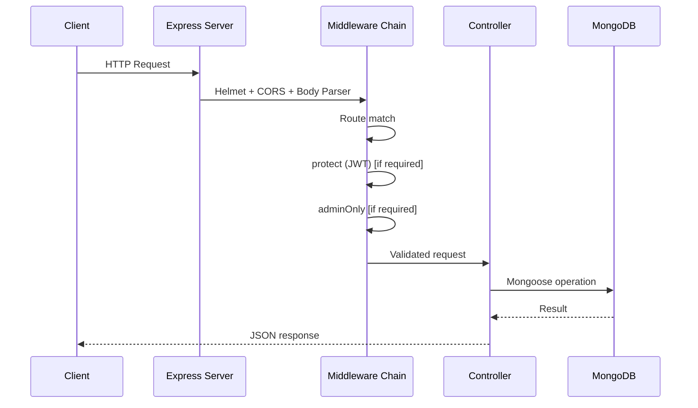
```mermaid
sequenceDiagram
    participant C as Client
    participant S as Express Server
    participant MW as Middleware Chain
    participant Ctrl as Controller
    participant DB as MongoDB

    C->>S: HTTP Request
    S->>MW: Helmet + CORS + Body Parser
    MW->>MW: Route match
    MW->>MW: protect (JWT) [if required]
    MW->>MW: adminOnly [if required]
    MW->>Ctrl: Validated request
    Ctrl->>DB: Mongoose operation
    DB-->>Ctrl: Result
    Ctrl-->>C: JSON response
```

### 2.4 Database Architecture

The data tier uses **MongoDB** with **Mongoose ODM**. The schema design is document-oriented with ObjectId references between collections to support independent querying and population.

| Collection | Model | Purpose |
|---|---|---|
| `users` | `User` | Student and admin accounts |
| `books` | `Book` | Library catalogue entries |
| `borroweds` | `Borrowed` | Borrow, reserve, return, cancel records |
| `contactmessages` | `ContactMessage` | Support and enquiry submissions |

### 2.5 Technology Stack

#### 2.5.1 Backend Technologies

| Component | Technology | Version (package.json) | Justification |
|---|---|---|---|
| Runtime | Node.js | ≥ 18 | Non-blocking I/O suitable for API servers |
| Framework | Express | ^5.2.1 | Minimal, flexible HTTP routing |
| Database | MongoDB | 6+ | Flexible document schema for library data |
| ODM | Mongoose | ^9.6.2 | Schema validation, hooks, population |
| Authentication | jsonwebtoken | ^9.0.3 | Stateless JWT-based auth |
| Password Hashing | bcrypt | ^6.0.0 | Industry-standard password hashing (cost 10) |
| Security Headers | Helmet | ^8.2.0 | Automatic HTTP security headers |
| CORS | cors | ^2.8.6 | Cross-origin access control |
| Validation | validator | ^13.15.35 | Email and string validation |
| Environment | dotenv | ^17.4.2 | Secure configuration management |

#### 2.5.2 Frontend Technologies

| Component | Technology | Version | Justification |
|---|---|---|---|
| Markup | HTML5 | — | Semantic, accessible structure |
| Styling | CSS3 + Bootstrap | 5.3.3 | Responsive grid and components |
| Icons | Bootstrap Icons | 1.11.3 | Consistent iconography |
| Typography | Inter (Google Fonts) | — | Readable academic typography |
| Scripting | Vanilla JavaScript | ES6+ | No framework overhead |
| HTTP Client | Fetch API | — | Native, promise-based requests |

#### 2.5.3 Admin Dashboard Technologies

| Component | Technology | Notes |
|---|---|---|
| Architecture | ES Modules SPA | `type="module"` entry via `main.js` |
| Charting | Chart.js 4.4.1 | Loaded in dashboard (ready for charts) |
| State | localStorage | `adminToken`, `adminUser`, theme preference |
| API Client | `modules/api.js` | Centralised fetch wrapper with 401 handling |

#### 2.5.4 Development & Infrastructure

| Tool | Purpose |
|---|---|
| npm | Package and dependency management |
| Git | Version control |
| MongoDB Atlas / Local | Database hosting |
| VS Code | Primary development environment |

---

## 3. Functional Requirements

### 3.1 Detailed Features

#### 3.1.1 Authentication & Account Management

| ID | Requirement | Priority |
|---|---|---|
| FR-01 | Users shall register with full name, email, password, faculty (IT/BA), and academic year | HIGH |
| FR-02 | Passwords shall be at least 8 characters | HIGH |
| FR-03 | Login shall validate credentials and issue a signed JWT | HIGH |
| FR-04 | Deactivated accounts shall be rejected at login and on every protected request | HIGH |
| FR-05 | Authenticated users shall view and update profile (name, faculty, year) | MEDIUM |
| FR-06 | Authenticated users shall change password with current-password verification | MEDIUM |
| FR-07 | Admin dashboard login shall reject non-admin roles client-side | HIGH |
| FR-08 | Post-login redirect: admin → `/dashboard`, student → `search.html` | MEDIUM |

#### 3.1.2 Book Catalogue Management

| ID | Requirement | Priority |
|---|---|---|
| FR-09 | Admins shall create books with title, author, category, faculty, year, description, copies, URLs | HIGH |
| FR-10 | Admins shall update any book field with validation | HIGH |
| FR-11 | Admins shall soft-delete (archive) books via DELETE or toggle-status | HIGH |
| FR-12 | Admins shall restore archived books via toggle-status | MEDIUM |
| FR-13 | Public listing shall support text search across title, author, category, description | HIGH |
| FR-14 | Listing shall support filters: faculty, academic year, category | HIGH |
| FR-15 | Book availability (available/total copies) shall be visible to all users | HIGH |

#### 3.1.3 Borrowing & Reservation

| ID | Requirement | Priority |
|---|---|---|
| FR-16 | Students shall borrow available books; copies decremented atomically | HIGH |
| FR-17 | Default loan duration shall be 14 calendar days | HIGH |
| FR-18 | Students shall reserve unavailable books without decrementing copies | HIGH |
| FR-19 | Students shall return borrowed books; copies incremented atomically | HIGH |
| FR-20 | Students shall cancel their own reservations | HIGH |
| FR-21 | System shall detect overdue loans (borrowed + dueDate < now) | HIGH |
| FR-22 | Personal loan dashboard shall show active, reserved, overdue, and due-soon items | HIGH |
| FR-23 | Admins shall view all loan transactions with optional status filter | HIGH |
| FR-24 | Admins shall process returns on behalf of any user | MEDIUM |
| FR-25 | A user shall not hold duplicate active borrow/reserve records for the same book | HIGH |

#### 3.1.4 User Management (Admin)

| ID | Requirement | Priority |
|---|---|---|
| FR-26 | Admins shall view all registered accounts | HIGH |
| FR-27 | Admins shall promote students to admin or demote admins to students | HIGH |
| FR-28 | Admins shall activate or deactivate user accounts | HIGH |

#### 3.1.5 Contact & Support

| ID | Requirement | Priority |
|---|---|---|
| FR-29 | Authenticated users shall submit contact messages | MEDIUM |
| FR-30 | Admins shall view, update status, and delete contact messages | MEDIUM |

#### 3.1.6 Accessibility

| ID | Requirement | Priority |
|---|---|---|
| FR-31 | Users shall adjust font size (80%–150%) | HIGH |
| FR-32 | Users shall enable high-contrast mode | HIGH |
| FR-33 | Screen-reader mode with ARIA live regions shall be supported | HIGH |
| FR-34 | Keyboard shortcuts (Shift+C contact, Shift+R search) shall be available | MEDIUM |
| FR-35 | Accessibility preferences shall persist in localStorage | HIGH |

### 3.2 User Stories

**As a Student:**

| ID | Story |
|---|---|
| US-S01 | I want to search books by title or author so that I can quickly find course materials. |
| US-S02 | I want to filter by faculty (IT/BA) and academic year so that I see relevant resources. |
| US-S03 | I want to borrow an available book online so that I do not need to visit the library physically. |
| US-S04 | I want to reserve an unavailable book so that I can track my place in the queue. |
| US-S05 | I want to see borrowed books and due dates so that I can avoid overdue penalties. |
| US-S06 | I want to return a book through the system so that my loan record updates immediately. |
| US-S07 | I want to adjust font size and contrast so that the platform is comfortable for my visual needs. |
| US-S08 | I want to contact library support so that I can report issues or ask questions. |

**As an Administrator:**

| ID | Story |
|---|---|
| US-A01 | I want to add and edit books so that the catalogue stays current. |
| US-A02 | I want to archive outdated books so they no longer appear in student search. |
| US-A03 | I want dashboard statistics so that I can monitor library activity. |
| US-A04 | I want to manage user roles and account status so that I control system access. |
| US-A05 | I want to view and process all loans so that I can handle returns and overdue items. |
| US-A06 | I want a global search across books, members, and loans so that I find information quickly. |

### 3.3 Business Rules

| ID | Rule |
|---|---|
| BR-01 | A book cannot be borrowed when `availableCopies == 0`; reservation is permitted instead |
| BR-02 | `availableCopies` must satisfy `0 ≤ availableCopies ≤ totalCopies` |
| BR-03 | Borrow and return operations use MongoDB transactions for atomicity |
| BR-04 | Deactivated users (`isActive: false`) cannot log in or access protected endpoints |
| BR-05 | Only `role: "admin"` users may access admin API routes and the admin dashboard |
| BR-06 | Registration always assigns `role: "student"`; promotion requires admin action |
| BR-07 | Archived books (`isActive: false`) are excluded from public listings |
| BR-08 | Default loan period is exactly 14 calendar days from borrow date |
| BR-09 | A loan is overdue when `status === "borrowed"` and `dueDate < currentDate` |
| BR-10 | Contact message lifecycle: `new` → `read` → `resolved` |
| BR-11 | A user may have at most one active record (`borrowed` or `reserved`) per book |
| BR-12 | Returning a `reserved` record changes status without incrementing copy count |
| BR-13 | Cancelling a reservation is permitted only for the owning user on `status: "reserved"` records |

---

## 4. Non-Functional Requirements

### 4.1 Performance

| ID | Requirement |
|---|---|
| NFR-P1 | Book listing API shall respond within 500 ms under normal load |
| NFR-P2 | Search queries use MongoDB regex and text indexes for efficient filtering |
| NFR-P3 | Frontend pages shall render initial content within 3 seconds on typical connections |
| NFR-P4 | Inventory mutations (borrow/return) shall complete within a single MongoDB transaction |

### 4.2 Security

| ID | Requirement |
|---|---|
| NFR-S1 | Passwords hashed with bcrypt (cost factor 10) before persistence |
| NFR-S2 | Protected endpoints require valid, unexpired JWT Bearer tokens |
| NFR-S3 | Helmet enforces HTTP security headers |
| NFR-S4 | Request bodies limited to 10 KB |
| NFR-S5 | `x-powered-by` header disabled |
| NFR-S6 | CORS restricted to configured origins (`CORS_ORIGIN` env variable) |
| NFR-S7 | Stack traces hidden in production error responses |
| NFR-S8 | JWT payload contains only `id` and `role` |

### 4.3 Scalability

| ID | Requirement |
|---|---|
| NFR-SC1 | Stateless JWT auth enables horizontal API scaling behind a load balancer |
| NFR-SC2 | Indexes on `email`, `userId`, `bookId`, and compound `{ userId, bookId, status }` |
| NFR-SC3 | Admin dashboard served as static assets, suitable for CDN distribution |

### 4.4 Maintainability

| ID | Requirement |
|---|---|
| NFR-M1 | Separation of concerns: routes, controllers, models, middleware |
| NFR-M2 | Input validation centralised in `validators.js` |
| NFR-M3 | Shared frontend behaviour in `accessibility-init.js` |
| NFR-M4 | Admin dashboard uses ES modules for modular structure |
| NFR-M5 | Configuration via `.env`, not hardcoded secrets |

### 4.5 Reliability

| ID | Requirement |
|---|---|
| NFR-R1 | Borrow/return use MongoDB sessions and transactions |
| NFR-R2 | Global error handler returns structured JSON for unhandled errors |
| NFR-R3 | All error responses include `success: false` and `message` |
| NFR-R4 | Admin API client dispatches `auth:expired` on 401 and returns to login |

### 4.6 Usability

| ID | Requirement |
|---|---|
| NFR-U1 | Responsive layout for viewports ≥ 320 px |
| NFR-U2 | Accessibility features aligned with WCAG 2.1 AA where applicable |
| NFR-U3 | Toast/alert feedback for user actions |
| NFR-U4 | Loading spinners during asynchronous fetches |
| NFR-U5 | Empty states with actionable guidance (e.g., "Browse books") |

---

## 4.x UI Screens and Functional Specifications

This section provides a rigorous, comprehensive architectural breakdown of the EELU Library Hub user interface ecosystem. The system is bifurcated into two primary modules: the **Client-Facing Web Application** (serving university students and general users) and the **Admin Management Panel** (serving library administrators). Each screen is analyzed through its structural taxonomy, behavioral design, and navigation mappings to satisfy enterprise software engineering documentation standards.

---

### Part 1: Client-Facing Web Application Modules

---

#### Screen 1: Portal Gateway (index.html)

**Purpose:** Serves as the application's stateless root router, providing direct, non-authenticated entry paths to modular micro-pages for seamless architectural isolation during demonstration, development, and standalone audits.

**Screenshot:**

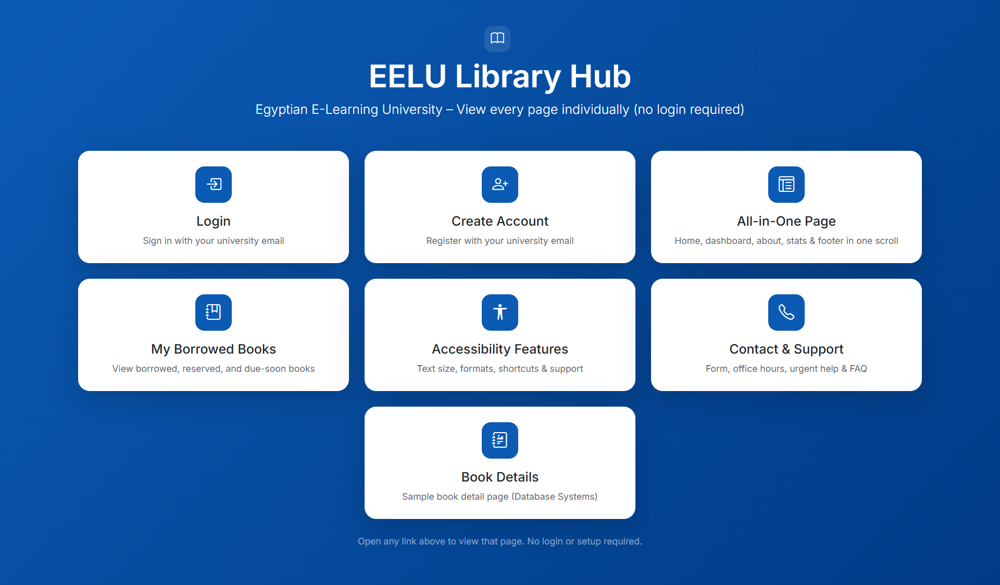

> *Figure 4.x.1 — Portal Gateway Screen (index.html): The application entry point displaying the 7-tile navigation grid for direct module access.*

**Main Components:**

| Component | Description |
|---|---|
| Brand Header | Prominently features the "EELU Library Hub" typographic lockup and dynamic subtitle emphasizing zero-setup access |
| Navigation Grid | CSS Grid layout containing 7 high-contrast dashboard tiles: Login, Create Account, All-in-One Page, My Borrowed Books, Accessibility Features, Contact & Support, Book Details |
| Status Footer | Bottom contextual caption establishing legal ownership and runtime parameters |

**User Actions:**
- Click on any card component to trigger immediate viewport routing to the isolated module.

**Navigation Flow:**

| Trigger | Destination |
|---|---|
| Click "Login" card | `login.html` |
| Click "Create Account" card | `register.html` |
| Click "All-in-One Page" card | `combined.html` |
| Click "My Borrowed Books" card | `my-borrowed.html` |
| Click "Accessibility Features" card | `accessibility.html` |
| Click "Contact & Support" card | `contact.html` |
| Click "Book Details" card | `book-details.html` |

**Design Notes:** Built on a solid monochrome cobalt backdrop to prioritize high visual contrast. Components leverage generous target padding, centered micro-iconographies, and flat typography to minimize cognitive load.

---

#### Screen 2: Student Authentication Gateway (login.html)

**Purpose:** Handles user access control by securing student sessions via university email and password verification.

**Screenshot:**

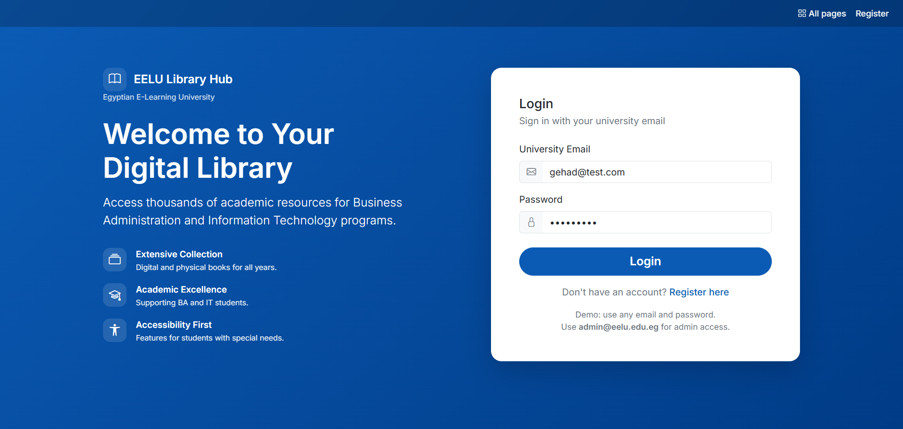

> *Figure 4.x.2 — Student Authentication Gateway (login.html): Asymmetric split-screen layout with feature sidebar and login card.*

**Main Components:**

| Component | Description |
|---|---|
| Value Proposition Sidebar | Left-hand structural column communicating system capabilities (Extensive Collection, Academic Excellence, Accessibility First) |
| Authentication Card | Right-aligned semantic `<form>` container |
| Input Fields | University Email (with inline envelope icon) and type-masked Password field |
| Action Triggers | Primary "Login" CTA button and secondary "Register here" redirection link |
| Fallback Sandbox Banner | Helper text outlining sandbox admin credentials (`admin@eelu.edu.eg`) |

**User Actions:**
- Input alphanumeric credentials into targeted data fields.
- Fire form submission via the Login button.
- Click "Register here" to invoke account creation.

**Navigation Flow:**

| Trigger | Destination |
|---|---|
| Successful Authentication | Student Portal Dashboard (`combined.html`) |
| Admin Credentials | Admin Dashboard (`/dashboard`) |
| Click "Register here" | Registration Panel (`register.html`) |

**Design Notes:** Employs an asymmetric split-screen layout. The login panel features a clean white backdrop with subtle drop-shadow properties to elevate the control form layer off the primary background canvas.

---

#### Screen 3: User Registration Panel (register.html)

**Purpose:** Enables new academic members to securely provision an account within the library management database.

**Screenshot:**

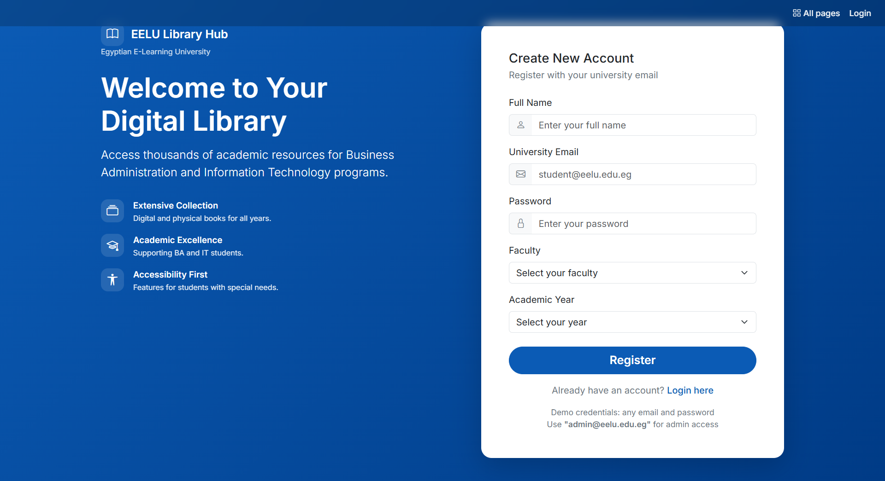

> *Figure 4.x.3 — User Registration Panel (register.html): Account creation form with faculty and academic year metadata selectors.*

**Main Components:**

| Component | Description |
|---|---|
| Unified Split Sidebar | Standardized left-side value panel maintaining visual continuity across authentication gateways |
| Registration Form Control | Center-right surface housing comprehensive user data collection fields |
| Data Inputs | Fields for Full Name, University Email (`@eelu.edu.eg` placeholder), and protected Password |
| Academic Metadata Dropdowns | Semantic `<select>` elements for Faculty allocation and Academic Year categorization |
| Action Triggers | "Register" submission button and "Login here" backward navigation link |

**User Actions:**
- Complete all registration fields including faculty and year dropdowns.
- Dispatch form data via the primary Register trigger.

**Navigation Flow:**

| Trigger | Destination |
|---|---|
| Successful Registration | Login Gateway (`login.html`) with success flash message |
| Click "Login here" | Student Login Gateway (`login.html`) |

**Design Notes:** Dropdown selector inputs are designed with ample tap targets to maintain strict alignment with modern accessibility paradigms. Input states feature visible inner border padding to preserve layout structural integrity under focus events.

---

#### Screen 4: Integrated Student Portal Dashboard (combined.html)

**Purpose:** Serves as the primary authenticated application layout for students, presenting personalized statuses, faculty material indices, and direct functional shortcuts.

**Screenshot:**

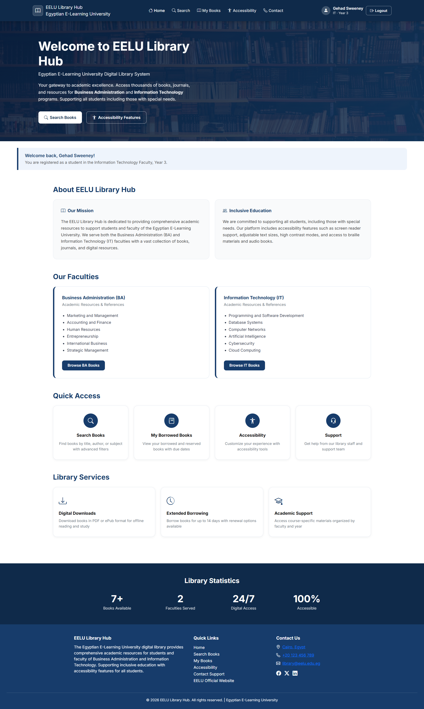

> *Figure 4.x.4 — Integrated Student Portal Dashboard (combined.html): Full authenticated home page with contextual greeting, faculty sections, and quick access tiles.*

**Main Components:**

| Component | Description |
|---|---|
| Persistent Global Navigation Bar | Brand title, structural links (Home, Search, My Books, Accessibility, Contact), user profile indicator, and Logout handler |
| Hero Banner | High-impact introduction card with digital library vision overlayed on a library stack graphic |
| Contextual Greeting Stripe | Dynamic personalized banner: *"Welcome back, Gehad Sweeney! You are registered as a student in the Information Technology Faculty, Year 3."* |
| Organizational Overview Grid | Two information panels covering institutional mission and inclusive educational toolsets |
| Academic Faculty Splitter | Independent content segments for Business Administration (BA) and Information Technology (IT) with direct CTA browsing hooks |
| Quick Access Tile Matrix | Centralized functional matrix for core transactional modules |
| Library Metrics Footer | Deep navy band exposing global metrics: 7+ Books Available, 2 Faculties Served, 24/7 Access, 100% Accessible |

**User Actions:**
- Execute application state queries via navigation headers.
- Filter resources by invoking targeted Faculty triggers.
- Transition to utility tools via the Quick Access matrix.

**Navigation Flow:**

| Trigger | Destination |
|---|---|
| Click "Search Books" | Search interface (`search.html`) |
| Click "Browse BA Books" / "Browse IT Books" | Search with faculty pre-filter applied |
| Click "Accessibility Features" | Accessibility settings (`accessibility.html`) |
| Click "Logout" | Flushes JWT, redirects to `login.html` |

**Design Notes:** Leverages a multi-tier content stack. White and soft muted blue panel palettes maximize readability, with clear spacing blocks cleanly separating discrete data sections.

---

#### Screen 5: Book Search & Catalog (search.html)

**Purpose:** Provides students with a fully filterable catalog view of all active library books, with direct borrow and reserve capabilities.

**Screenshot:**

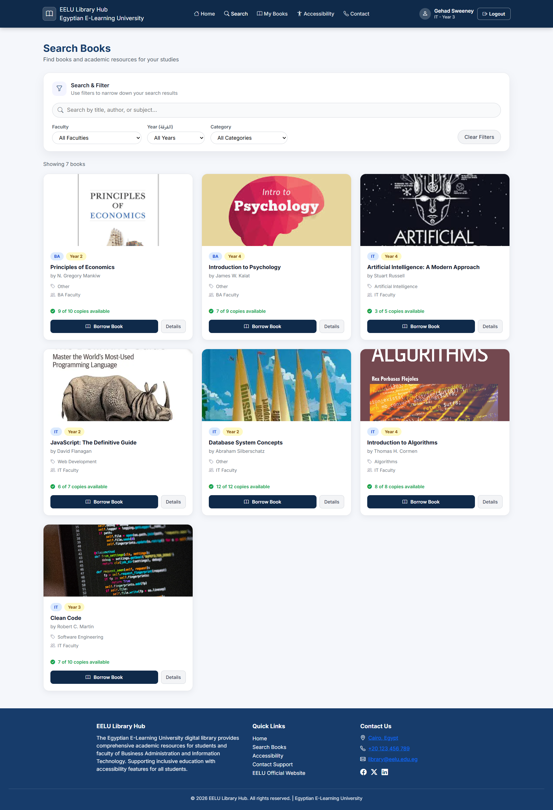

> *Figure 4.x.5 — Book Search & Catalog (search.html): Real-time client-side filtered book grid with borrow/reserve actions.*

**Main Components:**

| Component | Description |
|---|---|
| Search & Filter Panel | Full-text search bar with Faculty, Year, and Category dropdown filters and a "Clear Filters" control |
| Book Card Grid | Responsive multi-column grid displaying cover image, title, author, category, faculty/year badges, availability indicator, and action buttons |
| Borrow/Reserve Buttons | Context-aware primary actions per card: "Borrow Book" when copies available; "Reserve" when unavailable |
| Results Count | Live indicator showing total filtered results (e.g., *"Showing 7 books"*) |

**User Actions:**
- Type search queries for real-time filtering across title, author, and subject.
- Apply dropdown filters for Faculty, Year, and Category.
- Click "Borrow Book" to initiate a borrow transaction.
- Click "Details" to navigate to the full book detail view.

**Navigation Flow:**

| Trigger | Destination |
|---|---|
| Click "Details" | Book Details page (`book-details.html?id=…`) |
| Successful Borrow/Reserve | Redirects to `my-borrowed.html` |

**Design Notes:** Clean card-based grid layout with book cover thumbnails as the primary visual anchor. Faculty and year badges provide immediate contextual filtering at a glance.

---

#### Screen 6: My Borrowed Books (my-borrowed.html)

**Purpose:** Provides each authenticated student with a personalized dashboard to track, manage, and act on their current loan and reservation records.

**Screenshot:**

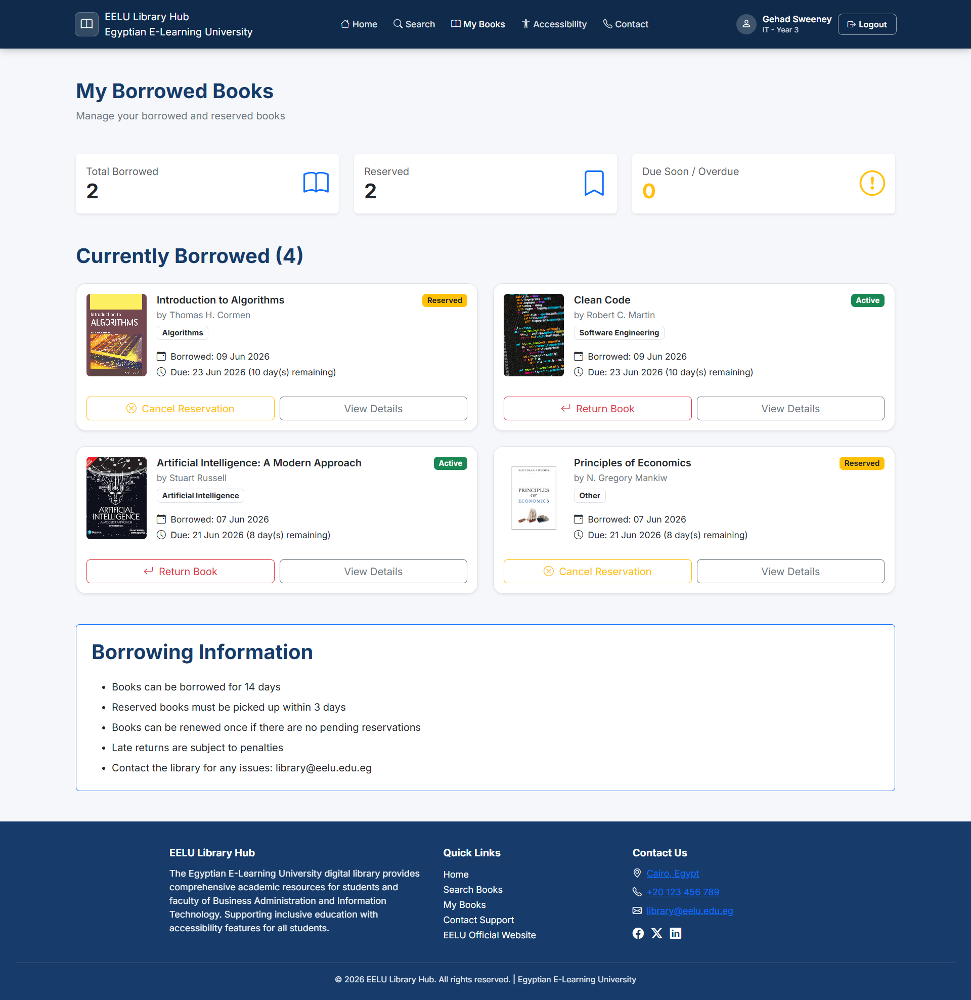

> *Figure 4.x.6 — My Borrowed Books (my-borrowed.html): Personal loan tracker with status indicators, due dates, and return/cancel actions.*

**Main Components:**

| Component | Description |
|---|---|
| Summary Stats Row | Three KPI counters: Total Borrowed, Reserved, and Due Soon / Overdue |
| Currently Borrowed Card Grid | Book cards showing cover image, title, author, category badge, borrowed date, due date with days remaining, and status badge |
| Action Buttons | Context-sensitive per card: "Return Book" for active loans; "Cancel Reservation" for reserved items; "View Details" for all |
| Borrowing Information Panel | Policy rules: 14-day borrowing period, 3-day reservation pickup window, renewal policy, and late return penalties |

**User Actions:**
- Click "Return Book" to process a return transaction.
- Click "Cancel Reservation" to cancel an active reservation.
- Click "View Details" to navigate to the book's detail page.

**Navigation Flow:**

| Trigger | Destination |
|---|---|
| Return / Cancel action | Page reloads with updated loan list and toast notification |
| Click "View Details" | Book Details page (`book-details.html?id=…`) |

**Design Notes:** Status badges use a clear color system: green for Active/Returned, yellow/orange for Reserved, red for Overdue. Due date countdowns with days remaining create urgency for upcoming deadlines.

---

#### Screen 7: Institutional Support & Communication Center (contact.html)

**Purpose:** Provides students with dedicated communication channels, asynchronous message dispatching, and an interactive FAQ accordion.

**Screenshot:**

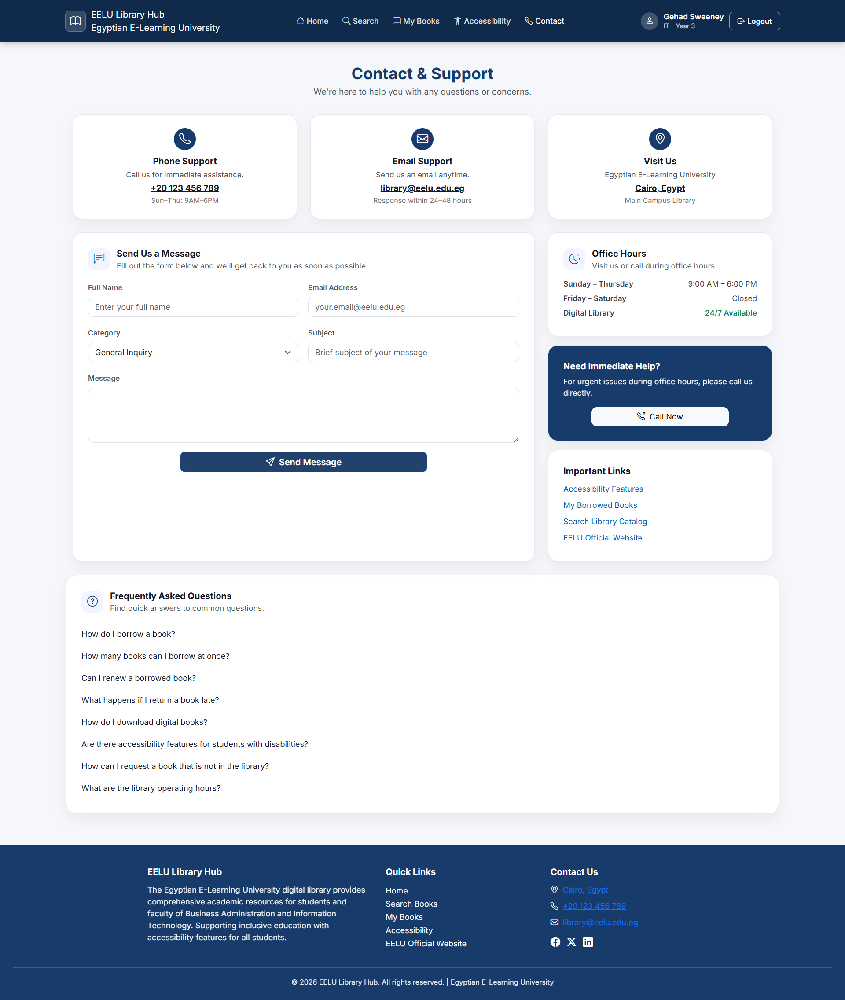

> *Figure 4.x.7 — Contact & Support (contact.html): Asymmetric dual-column layout with message form, office hours sidebar, and FAQ accordion.*

**Main Components:**

| Component | Description |
|---|---|
| Direct Channel Card Row | Three horizontal cards: Phone Support (+20 123 456 789), Email Support (library@eelu.edu.eg), and Physical Location (Cairo, Egypt) |
| Asynchronous Message Console | Left-hand form with Full Name, Email Address, Category selector, Subject string, and multi-line `<textarea>` for custom messages |
| Operations Sidebar Panel | Right-hand panel with structured working hours (Sun–Thu 9AM–6PM; Fri–Sat Closed; Digital Library 24/7) and Important Links |
| FAQ Accordion Framework | Vertical accordion stack with answers to high-frequency inquiries (borrowing rules, renewals, digital downloads, accessibility, etc.) |

**User Actions:**
- Input structured inquiries into the message console.
- Click "Send Message" to dispatch the support request.
- Click FAQ nodes to expand/collapse detail rows.

**Navigation Flow:**

| Trigger | Destination |
|---|---|
| Form Submission | Dispatches message payload to Admin Panel datastore; displays success toast |
| Important Links | Routes to `accessibility.html`, `my-borrowed.html`, `search.html`, and EELU Official Website |

**Design Notes:** Employs an asymmetrical 65/35 dual-column layout for the main message dispatch framework to guarantee ideal visual proportions on desktop viewports. The FAQ accordion reduces support load by surfacing common answers inline.

---

#### Screen 8: Accessibility Features (accessibility.html)

**Purpose:** Provides a dedicated settings panel for students to customize their reading experience with tools designed to support all abilities, including visual impairments and mobility limitations.

**Screenshot:**

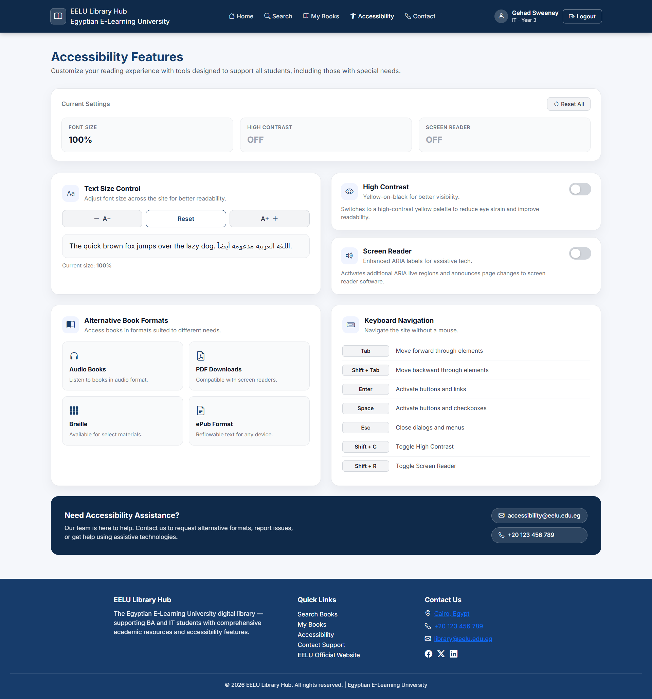

> *Figure 4.x.8 — Accessibility Features (accessibility.html): Comprehensive accessibility control panel with text size, high contrast, screen reader, and keyboard navigation settings.*

**Main Components:**

| Component | Description |
|---|---|
| Current Settings Banner | Live status display showing active Font Size (%), High Contrast state (ON/OFF), and Screen Reader state (ON/OFF), with a global "Reset All" control |
| Text Size Control | Font size adjustment panel with A–, Reset, and A+ buttons; live preview sentence including Arabic text; current size percentage indicator |
| High Contrast Toggle | Toggle switch activating a yellow-on-black palette for improved visibility; includes descriptive label |
| Screen Reader Toggle | Toggle switch activating enhanced ARIA live regions for assistive technology software |
| Alternative Book Formats | Information panel listing available formats: Audio Books, PDF Downloads, Braille, and ePub Format |
| Keyboard Navigation Reference | Visual keyboard shortcut guide: Tab, Shift+Tab, Enter, Space, Esc, Shift+C (High Contrast), Shift+R (Screen Reader) |
| Accessibility Assistance Banner | Contact block with `accessibility@eelu.edu.eg` and phone number for requesting additional support |

**User Actions:**
- Click A– / A+ buttons to decrease or increase font size (range 80%–150%).
- Toggle High Contrast mode on/off.
- Toggle Screen Reader ARIA enhancements on/off.
- Click "Reset All" to restore all defaults.
- Use keyboard shortcuts as an alternative to mouse interaction.

**Navigation Flow:**
- All changes persist to `localStorage` and apply globally across all student-facing pages on the next load.

**Design Notes:** Accessibility settings are the most interaction-dense screen in the student module. The current settings banner at the top provides immediate visual feedback on active state. The keyboard shortcut reference doubles as an accessible onboarding guide for keyboard-only users.

---

### Part 2: Admin Management Panel Modules

---

#### Screen 9: Administrative Authentication Gateway (dashboard/login)

**Purpose:** Enforces single-purpose administrative credential verification to safely isolate management workflows from standard student boundaries.

**Screenshot:**

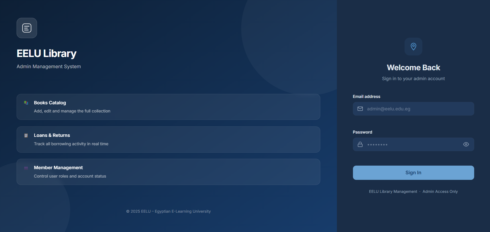

> *Figure 4.x.9 — Administrative Authentication Gateway (dashboard/login): Ultra-dark themed admin login with feature summary sidebar and secure form container.*

**Main Components:**

| Component | Description |
|---|---|
| Operational Feature Summary Sidebar | Left-aligned dark indigo pane displaying core management features: Books Catalog, Loans & Returns, Member Management |
| Secure Form Container | Sleek right-aligned dashboard login module |
| Form Controls | Email address field and visibility-toggleable password component |
| Action Controls | "Sign In" button with security label confirmation footer: *"EELU Library Management • Admin Access Only"* |

**User Actions:**
- Input administrative account credentials.
- Toggle password visibility via the inline eye icon.
- Click "Sign In" to authenticate.

**Navigation Flow:**

| Trigger | Destination |
|---|---|
| Successful Validation | Central Admin Dashboard (`dashboard/index`) |
| Non-admin credentials | Rejected client-side with error message |

**Design Notes:** Styled with an ultra-dark navy color scheme to visually differentiate the management environment from the public-facing student platform. This deliberate visual distinction prevents accidental admin operations.

---

#### Screen 10: Central Operational Command Dashboard (dashboard/index)

**Purpose:** Exposes global library Key Performance Indicators (KPIs) alongside real-time system activity logs.

**Screenshot:**

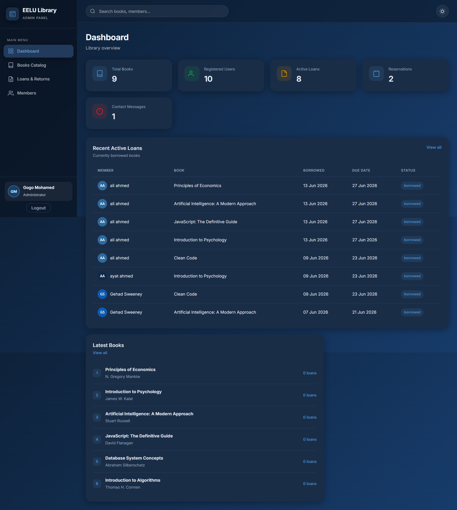

> *Figure 4.x.10 — Central Operational Command Dashboard (dashboard/index): KPI ribbon with 5 metric widgets, recent active loans table, and latest acquisitions panel.*

**Main Components:**

| Component | Description |
|---|---|
| Persistent Left Navigation Drawer | Vertical control panel with routing options (Dashboard, Books Catalog, Loans & Returns, Members) and a persistent Logout footer |
| KPI Summary Ribbon | Five quantitative metric containers: Total Books, Registered Users, Active Loans, Reservations, Contact Messages |
| Recent Active Loans Table | Tabular structure with columns: Member (avatar + name), Book, Borrowed Date, Due Date, Status badge |
| Latest Acquisitions Panel | Numbered list of recently added catalog entries with loan velocity counts |

**User Actions:**
- Navigate across management domains via the left drawer.
- Click "View all" to expand the full active lending ledger.

**Navigation Flow:**

| Trigger | Destination |
|---|---|
| Click "Books Catalog" | Books Catalog Manager |
| Click "Loans & Returns" | Transaction Log |
| Click "Members" | Authorization Controller |
| Click "View all" (Recent Loans) | Full Loans & Returns view |

**Design Notes:** Dark charcoal card surfaces (#1e293b) on a deep blue workspace background protect administrative operators from eye strain during long sessions. KPI widgets use distinct accent colors per metric type for rapid visual scanning.

---

#### Screen 11: Digital Books Catalog Manager (dashboard/books)

**Purpose:** Gives administrators full Create, Read, Update, Delete (CRUD) and archiving control over the library catalog.

**Screenshot:**

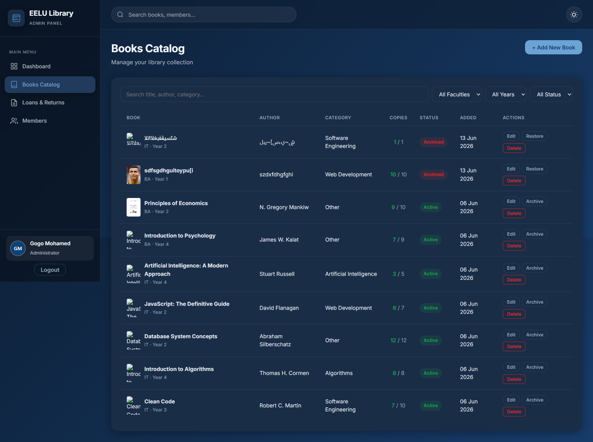

> *Figure 4.x.11 — Digital Books Catalog Manager (dashboard/books): Full CRUD table with search/filter ribbon, status badges, and row-level action controls.*

**Main Components:**

| Component | Description |
|---|---|
| Global Search & Filter Ribbon | Alphanumeric text filter + All Faculties, All Years, All Status dropdown selectors |
| "+ Add New Book" Button | Primary action trigger pinned to the upper right quadrant |
| Catalog Ledger Data Table | Multi-column table with: Book Cover + Title/Audience, Author, Category, Copies Ratio (Available/Total), Status Badge, Added Date |
| Row-Level Operation Handlers | Per-row action triggers: Edit, Archive/Restore, Delete |

**Status Badge System:**

| Badge | Color | Meaning |
|---|---|---|
| Active | Green | Book is publicly visible and borrowable |
| Archived | Orange/Red | Book is soft-deleted and hidden from students |

**User Actions:**
- Execute real-time text filter queries against table records.
- Click "+ Add New Book" to open the creation modal form.
- Click "Edit" to pull existing metadata into a modification wizard.
- Click "Archive" to soft-delete; "Restore" to re-activate.
- Click "Delete" (warning red) to permanently remove a record.

**Navigation Flow:**

| Trigger | Destination |
|---|---|
| "+ Add New Book" | Opens focused modal form overlay |
| "Edit" row action | Pulls metadata into modification wizard modal |

**Design Notes:** Implements strict data safety patterns; Delete commands are highlighted in warning red (#ef4444) to prevent accidental catalog modifications. Archive/Restore uses a toggle pattern to support reversible operations.

---

#### Screen 12: Global Loans & Returns Transaction Log (dashboard/loans)

**Purpose:** Serves as the central logging ledger for tracking, auditing, updating, and cancelling all book loan transactions across the system.

**Screenshot:**

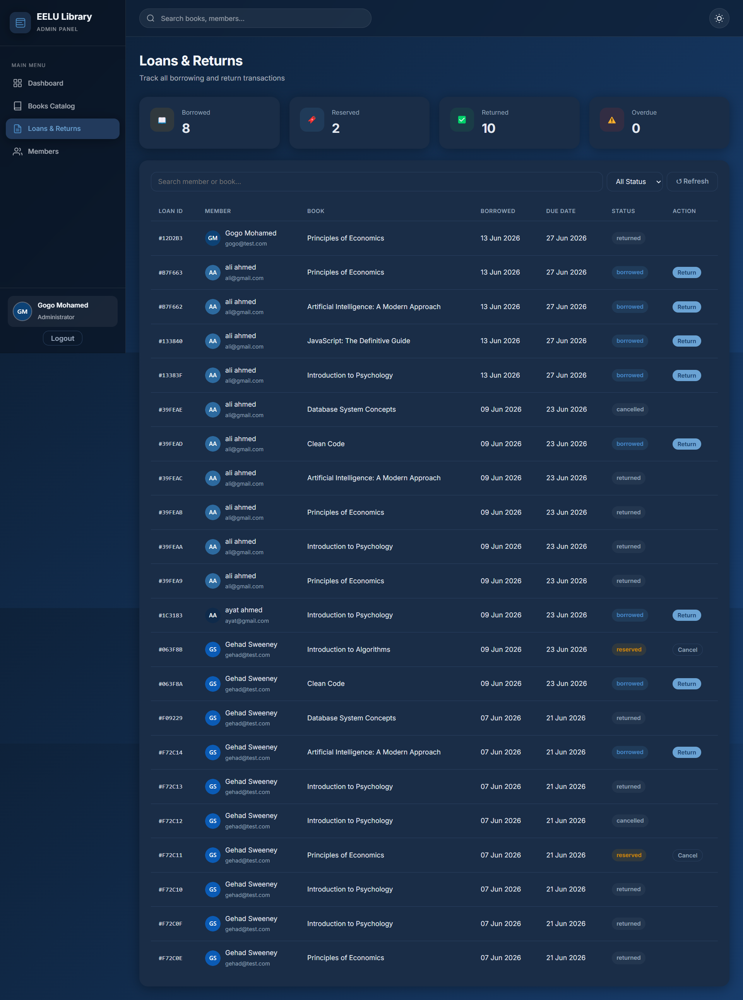

> *Figure 4.x.12 — Global Loans & Returns Transaction Log (dashboard/loans): Full audit grid with status breakdown ribbon and contextual inline transaction handlers.*

**Main Components:**

| Component | Description |
|---|---|
| Status Breakdown Ribbon | Four status monitor counters: Borrowed (8), Reserved (2), Returned (10), Overdue (0) |
| Audit Log Data Grid | Deep-level tracking grid with columns: Loan ID (hex prefix), Member (avatar + name + email), Book Title, Borrowed Date, Due Date, Status Badge, Action Button |
| Inline Transaction Handlers | Contextual buttons based on loan state: "Return" for active borrows; "Cancel" for active reservations |

**Status Badge Color System:**

| Badge | Color | Meaning |
|---|---|---|
| borrowed | Blue | Active loan in progress |
| reserved | Orange | Pending pickup reservation |
| returned | Green | Completed and returned |
| cancelled | Grey | Reservation was cancelled |

**User Actions:**
- Filter loan records using full-text search or status dropdown.
- Commit return logs by clicking row-level "Return" handlers.
- Cancel active reservations via row-level "Cancel" handlers.

**Navigation Flow:**
- All operations send asynchronous background updates to the database and refresh the transaction grid in-place without full page reload.

**Design Notes:** Color-coded status badges dramatically improve scan speed across long transaction logs. Contextual action buttons only appear when an action is applicable, reducing cognitive load and preventing invalid operations.

---

#### Screen 13: Member Management & Authorization Controller (dashboard/members)

**Purpose:** Provides administrators with complete user directory management, including role elevation/demotion, account activation, and deactivation controls.

**Screenshot:**

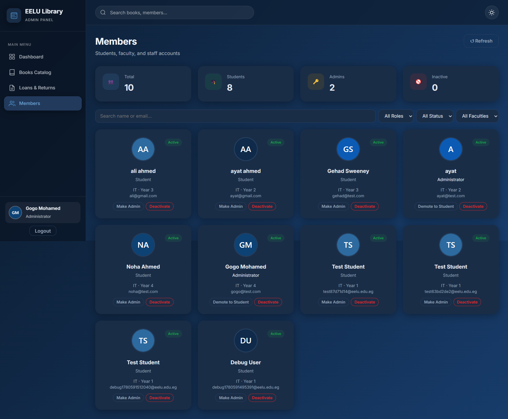

> *Figure 4.x.13 — Member Management & Authorization Controller (dashboard/members): User card grid with account category counters, filter toolbar, and inline role/status action handlers.*

**Main Components:**

| Component | Description |
|---|---|
| Account Category Counters | Summary row with four metrics: Total Accounts (10), Students (8), Admins (2), Inactive Accounts (0) |
| Directory Filter Toolbar | Advanced user search bar + All Roles, All Status, All Faculties filter dropdowns + Refresh button |
| User Account Grid Matrix | Multi-column card layout showing user initials avatar, full name, authorization level badge, academic year, email, and action buttons |
| Authorization Handlers | Per-card inline controls: "Make Admin" / "Demote to Student" (role toggle); "Deactivate" / "Activate" (status toggle) |

**User Actions:**
- Search and isolate member profiles using alphanumeric parameters.
- Elevate student permissions to admin via "Make Admin."
- Demote administrative credentials back to student via "Demote to Student."
- Revoke platform access via "Deactivate."
- Reinstate platform access via "Activate."

**Navigation Flow:**
- Role and status changes take effect immediately on the next API request or page refresh for the affected user, modifying their available interface views accordingly.

**Design Notes:** User profile cards organized in a clean multi-column grid with color-coded status badges (green Active, red/grey Inactive) allow administrators to assess the full user directory state at a glance. Initial-based avatars provide visual identity without requiring profile photos.

---

### 4.y Comprehensive UI Navigation Matrix

The structural chart below maps all navigation paths and access permissions across the system's operational states.

| Origin Screen | User Action Trigger | Target Destination | Authorization Constraint |
|---|---|---|---|
| Portal Gateway (`index.html`) | Click "Login" card | Student Login (`login.html`) | Public / Unauthenticated |
| Portal Gateway (`index.html`) | Click "Create Account" card | Registration Panel (`register.html`) | Public / Unauthenticated |
| Portal Gateway (`index.html`) | Click "All-in-One Page" card | Student Portal Dashboard (`combined.html`) | Public / Demo Mode |
| Portal Gateway (`index.html`) | Click "My Borrowed Books" card | My Borrowed (`my-borrowed.html`) | Public / Demo Mode |
| Portal Gateway (`index.html`) | Click "Accessibility Features" card | Accessibility (`accessibility.html`) | Public / Demo Mode |
| Portal Gateway (`index.html`) | Click "Contact & Support" card | Contact Center (`contact.html`) | Public / Demo Mode |
| Portal Gateway (`index.html`) | Click "Book Details" card | Book Details (`book-details.html`) | Public / Demo Mode |
| Student Login (`login.html`) | Click "Register here" link | Registration Panel (`register.html`) | Public / Unauthenticated |
| Student Login (`login.html`) | Successful Form Submit (Student) | Student Portal Dashboard (`combined.html`) | Authenticated Student |
| Student Login (`login.html`) | Successful Form Submit (Admin) | Admin Dashboard (`/dashboard`) | Authenticated Administrator |
| Registration Panel (`register.html`) | Click "Login here" link | Student Login (`login.html`) | Public / Unauthenticated |
| Registration Panel (`register.html`) | Successful Registration | Student Login (`login.html`) | Redirects with success message |
| Student Dashboard (`combined.html`) | Click "Search" in Nav | Book Search (`search.html`) | Authenticated Student |
| Student Dashboard (`combined.html`) | Click "My Books" in Nav | My Borrowed (`my-borrowed.html`) | Authenticated Student |
| Student Dashboard (`combined.html`) | Click "Contact" in Nav | Support Center (`contact.html`) | Authenticated Student |
| Student Dashboard (`combined.html`) | Click "Logout" Button | Student Login (`login.html`) | Destroys Active Session |
| Book Search (`search.html`) | Click "Details" on a book card | Book Details (`book-details.html`) | Authenticated Student |
| Book Search (`search.html`) | Click "Borrow Book" | My Borrowed (`my-borrowed.html`) | Authenticated Student |
| My Borrowed (`my-borrowed.html`) | Click "Return Book" | Page reloads with updated list | Authenticated Student |
| My Borrowed (`my-borrowed.html`) | Click "Cancel Reservation" | Page reloads with updated list | Authenticated Student |
| Contact (`contact.html`) | Submit "Send Message" form | Success toast; stays on page | Authenticated Student |
| Accessibility (`accessibility.html`) | Adjust font/contrast/reader | Settings persist to localStorage | Authenticated Student |
| Admin Login (`dashboard/login`) | Successful Form Submit | Central Admin Dashboard (`dashboard/index`) | Authenticated Administrator |
| Admin Drawer | Click "Books Catalog" link | Catalog Manager (`dashboard/books`) | Authenticated Administrator |
| Admin Drawer | Click "Loans & Returns" link | Transaction Log (`dashboard/loans`) | Authenticated Administrator |
| Admin Drawer | Click "Members" link | Authorization Controller (`dashboard/members`) | Authenticated Administrator |
| Admin Drawer | Click "Logout" Button | Admin Login Gateway (`dashboard/login`) | Destroys Admin Session |

---

## 5. User Roles and Permissions

### 5.1 Student

A **Student** is any registered user with `role: "student"`. Students interact primarily through the student frontend (`frontend/`).

**Capabilities:**

- Browse and search the public book catalogue
- View book details including availability and PDF links
- Borrow available books and reserve unavailable books
- Return borrowed books and cancel own reservations
- View personal loan history with overdue indicators
- Update profile and change password
- Submit contact/support messages
- Customise accessibility settings

### 5.2 Admin

An **Administrator** is a user with `role: "admin"`. Admins use the admin dashboard at `http://localhost:3000/dashboard`.

**Additional capabilities beyond student:**

- Full book catalogue CRUD (create, update, archive, restore, toggle status)
- View all users; change roles; activate/deactivate accounts
- View all loans; process returns for any user
- View dashboard summary and library statistics
- Manage contact messages (view, update status, delete)
- Global search across books, members, and loans

### 5.3 Permission Matrix

| Operation | Public (Guest) | Student | Admin |
|---|:---:|:---:|:---:|
| View active book catalogue | ✅ | ✅ | ✅ |
| View book details | ✅ | ✅ | ✅ |
| Register account | ✅ | — | — |
| Login (student frontend) | ✅ | ✅ | ✅* |
| Login (admin dashboard) | ✅ | ❌** | ✅ |
| View own profile (`GET /auth/me`) | ❌ | ✅ | ✅ |
| Update own profile | ❌ | ✅ | ✅ |
| Change own password | ❌ | ✅ | ✅ |
| Borrow a book | ❌ | ✅ | ✅† |
| Reserve a book | ❌ | ✅ | ✅† |
| Return own book | ❌ | ✅ | ✅ |
| Cancel own reservation | ❌ | ✅ | ✅ |
| View own loan history | ❌ | ✅ | ✅ |
| Submit contact message | ❌ | ✅ | ✅ |
| Add / edit / archive book | ❌ | ❌ | ✅ |
| View all users | ❌ | ❌ | ✅ |
| Change user role / status | ❌ | ❌ | ✅ |
| View all loans | ❌ | ❌ | ✅ |
| Return any user's loan | ❌ | ❌ | ✅ |
| Cancel another user's reservation | ❌ | ❌ | ❌‡ |
| View / manage contact messages | ❌ | ❌ | ✅ |
| Access admin dashboard | ❌ | ❌ | ✅ |
| View library statistics | ❌ | ❌ | ✅ |

\* Admins logging in via the student frontend are redirected to `/dashboard`.  
\** Admin dashboard login rejects non-admin roles in the client.  
† API permits any authenticated user; admins typically use the dashboard, not student borrow UI.  
‡ `cancelReservation` controller restricts cancellation to the record owner only.

---

## 6. Database Design

### 6.1 Collections / Tables Overview

| Collection | Mongoose Model | Purpose | Growth Pattern |
|---|---|---|---|
| `users` | `User` | Student and admin accounts | Low–Medium |
| `books` | `Book` | Library catalogue | Medium |
| `borroweds` | `Borrowed` | Loan lifecycle records | High (append-heavy) |
| `contactmessages` | `ContactMessage` | Support submissions | Low |

### 6.2 Fields

#### 6.2.1 Users Collection

| Field | Type | Required | Default | Constraints |
|---|---|---|---|---|
| `_id` | ObjectId | Auto | — | Primary key |
| `fullName` | String | ✅ | — | 3–120 chars, trimmed |
| `email` | String | ✅ | — | Unique, indexed, lowercase, valid email |
| `password` | String | ✅ | — | Min 8 chars, bcrypt hashed, `select: false` |
| `faculty` | String (enum) | ✅ | `"IT"` | `"IT"` \| `"BA"` |
| `academicYear` | String (enum) | ✅ | `"Year 1"` | `"Year 1"` – `"Year 4"` |
| `role` | String (enum) | ✅ | `"student"` | `"student"` \| `"admin"` |
| `isActive` | Boolean | — | `true` | Account status flag |
| `createdAt` | Date | Auto | — | Timestamp |
| `updatedAt` | Date | Auto | — | Timestamp |

**Indexes:** Unique index on `email`.

#### 6.2.2 Books Collection

| Field | Type | Required | Default | Constraints |
|---|---|---|---|---|
| `_id` | ObjectId | Auto | — | Primary key |
| `title` | String | ✅ | — | Max 200 chars |
| `author` | String | ✅ | — | Max 150 chars |
| `category` | String | ✅ | — | Max 120 chars |
| `faculty` | String (enum) | ✅ | — | `"IT"` \| `"BA"` |
| `academicYear` | String (enum) | ✅ | — | `"Year 1"` – `"Year 4"` |
| `description` | String | ✅ | — | Max 5000 chars |
| `coverImageUrl` | String | — | `""` | External URL |
| `pdfUrl` | String | — | `""` | External URL |
| `totalCopies` | Number | ✅ | — | Integer ≥ 0 |
| `availableCopies` | Number | ✅ | — | Integer ≥ 0, ≤ totalCopies |
| `isActive` | Boolean | — | `true` | Soft-delete flag |
| `createdBy` | ObjectId → User | — | — | Creating admin |
| `createdAt` / `updatedAt` | Date | Auto | — | Timestamps |

**Indexes:** Text index on `{ title, author, category }`.

#### 6.2.3 Borrowed Collection

| Field | Type | Required | Default | Constraints |
|---|---|---|---|---|
| `_id` | ObjectId | Auto | — | Primary key |
| `userId` | ObjectId → User | ✅ | — | Indexed |
| `bookId` | ObjectId → Book | ✅ | — | Indexed |
| `status` | String (enum) | — | `"borrowed"` | See state machine (§9.7) |
| `borrowDate` | Date | — | `Date.now` | Set on creation |
| `dueDate` | Date | — | borrowDate + 14d | Computed on creation |
| `returnDate` | Date | — | `null` | Set on return |
| `createdAt` / `updatedAt` | Date | Auto | — | Timestamps |

**Indexes:** Compound `{ userId: 1, bookId: 1, status: 1 }`.

#### 6.2.4 ContactMessages Collection

| Field | Type | Required | Default | Constraints |
|---|---|---|---|---|
| `_id` | ObjectId | Auto | — | Primary key |
| `name` | String | ✅ | — | Max 120 chars |
| `email` | String | ✅ | — | Valid email |
| `subject` | String | ✅ | — | Max 180 chars |
| `message` | String | ✅ | — | Max 5000 chars, min 10 chars |
| `status` | String (enum) | — | `"new"` | `"new"` \| `"read"` \| `"resolved"` |
| `submittedBy` | ObjectId → User | — | — | Authenticated submitter |
| `createdAt` | Date | Auto | — | Timestamp |

### 6.3 Relationships

| Relationship | Cardinality | Description |
|---|---|---|
| User → Borrowed | 1:N | One user, many loan records |
| Book → Borrowed | 1:N | One book, many loan records |
| User → ContactMessage | 1:N | One user, many submitted messages |
| User → Book (createdBy) | 1:N | Admin creates many catalogue entries |

### 6.4 Entity-Relationship Diagram

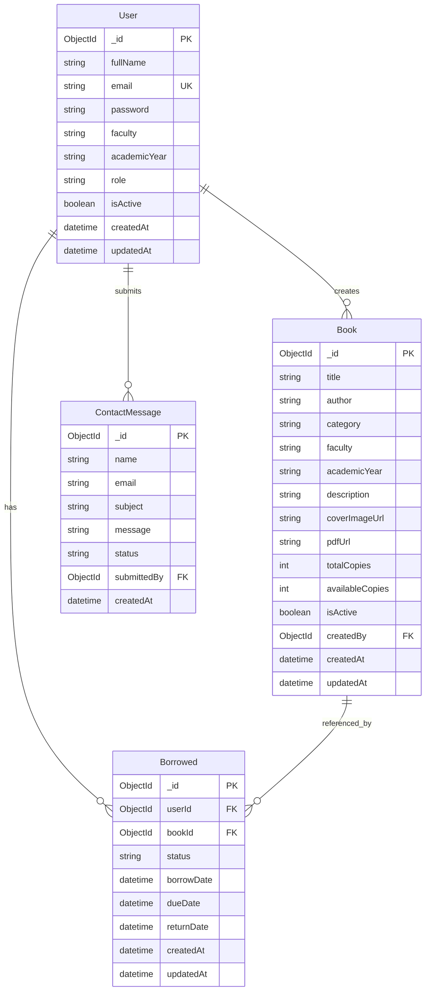
```mermaid
erDiagram
    User {
        ObjectId _id PK
        string fullName
        string email UK
        string password
        string faculty
        string academicYear
        string role
        boolean isActive
        datetime createdAt
        datetime updatedAt
    }

    Book {
        ObjectId _id PK
        string title
        string author
        string category
        string faculty
        string academicYear
        string description
        string coverImageUrl
        string pdfUrl
        int totalCopies
        int availableCopies
        boolean isActive
        ObjectId createdBy FK
        datetime createdAt
        datetime updatedAt
    }

    Borrowed {
        ObjectId _id PK
        ObjectId userId FK
        ObjectId bookId FK
        string status
        datetime borrowDate
        datetime dueDate
        datetime returnDate
        datetime createdAt
        datetime updatedAt
    }

    ContactMessage {
        ObjectId _id PK
        string name
        string email
        string subject
        string message
        string status
        ObjectId submittedBy FK
        datetime createdAt
    }

    User ||--o{ Borrowed : "has"
    Book ||--o{ Borrowed : "referenced_by"
    User ||--o{ ContactMessage : "submits"
    User ||--o{ Book : "creates"
```

---

## 7. API Documentation

**Base URL:** `http://localhost:3000/api`  
**Root health check:** `GET http://localhost:3000/`  
**Content-Type:** `application/json`  
**Authentication:** `Authorization: Bearer <JWT>` for protected routes

### 7.1 Standard Response Formats

**Success:**

```json
{
  "success": true,
  "message": "Optional human-readable message",
  "data": {},
  "token": "JWT (login only)",
  "user": {},
  "total": 0
}
```

**Error:**

```json
{
  "success": false,
  "message": "Human-readable error description",
  "errors": ["Field-level errors (validation only)"]
}
```

| HTTP Status | Meaning |
|---|---|
| 400 | Bad Request — validation or business rule failure |
| 401 | Unauthorized — missing, invalid, or expired token |
| 403 | Forbidden — authenticated but insufficient permissions |
| 404 | Not Found — resource does not exist |
| 409 | Conflict — duplicate resource |
| 500 | Internal Server Error |

---

### 7.2 Authentication Endpoints

#### POST `/auth/register`

| Attribute | Value |
|---|---|
| **Method** | POST |
| **URL** | `/api/auth/register` |
| **Description** | Register a new student account. Role is always `"student"`. Does not auto-login. |
| **Authentication** | Public |

**Request Body:**

```json
{
  "fullName": "Ahmed Hassan",
  "email": "ahmed@eelu.edu.eg",
  "password": "securePass123",
  "faculty": "IT",
  "academicYear": "Year 2"
}
```

**Success Response (201):**

```json
{
  "success": true,
  "message": "User registered successfully"
}
```

**Error Responses:**

| Status | Message |
|---|---|
| 400 | Validation error (e.g., `"Password must be at least 8 characters"`) |
| 409 | `"User already exists"` |
| 500 | Server error message |

---

#### POST `/auth/login`

| Attribute | Value |
|---|---|
| **Method** | POST |
| **URL** | `/api/auth/login` |
| **Description** | Authenticate user and receive JWT token |
| **Authentication** | Public |

**Request Body:**

```json
{
  "email": "ahmed@eelu.edu.eg",
  "password": "securePass123"
}
```

**Success Response (200):**

```json
{
  "success": true,
  "message": "Login successful",
  "token": "eyJhbGciOiJIUzI1NiIsInR5cCI6IkpXVCJ9...",
  "user": {
    "id": "648abc123def456789012345",
    "fullName": "Ahmed Hassan",
    "email": "ahmed@eelu.edu.eg",
    "faculty": "IT",
    "academicYear": "Year 2",
    "role": "student"
  }
}
```

**Error Responses:**

| Status | Message |
|---|---|
| 400 | Validation errors array |
| 401 | `"Invalid credentials"` (wrong password or inactive account) |
| 500 | Server error message |

---

#### GET `/auth/me`

| Attribute | Value |
|---|---|
| **Method** | GET |
| **URL** | `/api/auth/me` |
| **Description** | Retrieve authenticated user's profile |
| **Authentication** | JWT Required |

**Success Response (200):**

```json
{
  "success": true,
  "user": {
    "_id": "648abc123def456789012345",
    "fullName": "Ahmed Hassan",
    "email": "ahmed@eelu.edu.eg",
    "faculty": "IT",
    "academicYear": "Year 2",
    "role": "student",
    "isActive": true
  }
}
```

**Error Responses:**

| Status | Message |
|---|---|
| 401 | `"No token, access denied"` / `"Invalid or expired token"` / `"User not found or inactive"` |

---

#### PUT `/auth/me`

| Attribute | Value |
|---|---|
| **Method** | PUT |
| **URL** | `/api/auth/me` |
| **Description** | Update authenticated user's profile fields |
| **Authentication** | JWT Required |

**Request Body (partial):**

```json
{
  "fullName": "Ahmed Hassan Ali",
  "faculty": "IT",
  "academicYear": "Year 3"
}
```

**Success Response (200):**

```json
{
  "success": true,
  "message": "Profile updated successfully",
  "user": { "...updated user object..." }
}
```

---

#### PUT `/auth/change-password`

| Attribute | Value |
|---|---|
| **Method** | PUT |
| **URL** | `/api/auth/change-password` |
| **Description** | Change authenticated user's password |
| **Authentication** | JWT Required |

**Request Body:**

```json
{
  "currentPassword": "oldPass123",
  "newPassword": "newSecurePass456"
}
```

**Success Response (200):**

```json
{
  "success": true,
  "message": "Password changed successfully"
}
```

**Error Responses:**

| Status | Message |
|---|---|
| 400 | `"currentPassword and newPassword are required"` |
| 401 | `"Current password is incorrect"` |
| 404 | `"User not found"` |

---

### 7.3 Books Endpoints

#### GET `/books` and GET `/books/search`

| Attribute | Value |
|---|---|
| **Method** | GET |
| **URL** | `/api/books` or `/api/books/search` |
| **Description** | List active books with optional query filters |
| **Authentication** | Public |

**Query Parameters:**

| Parameter | Type | Description |
|---|---|---|
| `q` | string | Search title, author, category, description (case-insensitive regex) |
| `faculty` | string | `"IT"` or `"BA"` |
| `academicYear` / `year` | string | e.g., `"Year 2"` |
| `category` | string | Partial category match |
| `includeInactive` | string | `"true"` includes archived books |

**Success Response (200):**

```json
{
  "success": true,
  "total": 42,
  "data": [
    {
      "_id": "648bcd234ef567890123456",
      "title": "Introduction to Algorithms",
      "author": "Thomas H. Cormen",
      "category": "Algorithms",
      "faculty": "IT",
      "academicYear": "Year 4",
      "description": "A comprehensive introduction to algorithms...",
      "coverImageUrl": "https://example.com/cover.jpg",
      "pdfUrl": "https://example.com/book.pdf",
      "totalCopies": 10,
      "availableCopies": 7,
      "isActive": true,
      "createdAt": "2026-06-01T10:00:00.000Z"
    }
  ]
}
```

---

#### GET `/books/:id`

| Attribute | Value |
|---|---|
| **Method** | GET |
| **URL** | `/api/books/:id` |
| **Description** | Get a single active book by ObjectId |
| **Authentication** | Public |

**Success Response (200):** `{ "success": true, "data": { "...book..." } }`

**Error Responses:**

| Status | Message |
|---|---|
| 400 | `"Invalid book id"` |
| 404 | `"Book not found"` |

---

#### POST `/books`

| Attribute | Value |
|---|---|
| **Method** | POST |
| **URL** | `/api/books` |
| **Description** | Create a new catalogue entry |
| **Authentication** | JWT + Admin |

**Request Body:**

```json
{
  "title": "Database System Concepts",
  "author": "Abraham Silberschatz",
  "category": "Database Systems",
  "faculty": "IT",
  "academicYear": "Year 2",
  "description": "A comprehensive textbook on database systems and design.",
  "coverImageUrl": "https://example.com/cover.jpg",
  "pdfUrl": "https://example.com/book.pdf",
  "totalCopies": 12,
  "availableCopies": 12
}
```

**Success Response (201):** `{ "success": true, "message": "Book created successfully", "data": { "...book..." } }`

---

#### PUT `/books/:id`

| Attribute | Value |
|---|---|
| **Method** | PUT |
| **URL** | `/api/books/:id` |
| **Description** | Update book fields (partial update supported) |
| **Authentication** | JWT + Admin |

**Success Response (200):** `{ "success": true, "message": "Book updated successfully", "data": { "...book..." } }`

---

#### DELETE `/books/:id`

| Attribute | Value |
|---|---|
| **Method** | DELETE |
| **URL** | `/api/books/:id` |
| **Description** | Soft-delete book (`isActive: false`) |
| **Authentication** | JWT + Admin |

**Success Response (200):** `{ "success": true, "message": "Book archived successfully", "data": { "...book..." } }`

---

#### PATCH `/books/:id/toggle-status`

| Attribute | Value |
|---|---|
| **Method** | PATCH |
| **URL** | `/api/books/:id/toggle-status` |
| **Description** | Toggle `isActive` between active and archived |
| **Authentication** | JWT + Admin |

**Success Response (200):**

```json
{
  "success": true,
  "message": "Book activated successfully",
  "data": { "...book with toggled isActive..." }
}
```

---

### 7.4 Borrowed Endpoints

#### POST `/borrowed` or POST `/borrowed/borrow`

| Attribute | Value |
|---|---|
| **Method** | POST |
| **URL** | `/api/borrowed` or `/api/borrowed/borrow` |
| **Description** | Borrow an available book; atomically decrements `availableCopies` |
| **Authentication** | JWT Required |

**Request Body:**

```json
{
  "bookId": "648bcd234ef567890123456"
}
```

**Success Response (201):**

```json
{
  "success": true,
  "message": "Book borrowed successfully",
  "data": {
    "_id": "648cde345fg678901234567",
    "userId": "648abc123def456789012345",
    "bookId": "648bcd234ef567890123456",
    "status": "borrowed",
    "borrowDate": "2026-06-13T09:00:00.000Z",
    "dueDate": "2026-06-27T09:00:00.000Z"
  }
}
```

**Error Responses:**

| Status | Message |
|---|---|
| 400 | `"Valid bookId is required"` / `"No available copies"` / `"You already have an active record for this book"` / `"Book not found"` |

---

#### POST `/borrowed/reserve`

| Attribute | Value |
|---|---|
| **Method** | POST |
| **URL** | `/api/borrowed/reserve` |
| **Description** | Create a reservation without decrementing copy count |
| **Authentication** | JWT Required |

**Request Body:** `{ "bookId": "648bcd234ef567890123456" }`

**Success Response (201):** `{ "success": true, "message": "Book reserved successfully", "data": { "status": "reserved", "...": "..." } }`

**Error Responses:**

| Status | Message |
|---|---|
| 400 | `"Valid bookId is required"` |
| 404 | `"Book not found"` |
| 409 | `"You already have an active record for this book"` |

---

#### GET `/borrowed`, GET `/borrowed/my`

| Attribute | Value |
|---|---|
| **Method** | GET |
| **URL** | `/api/borrowed` or `/api/borrowed/my` |
| **Description** | Get authenticated user's loan history with computed fields |
| **Authentication** | JWT Required |

**Success Response (200):**

```json
{
  "success": true,
  "totalBorrowed": 3,
  "data": [
    {
      "_id": "648cde345fg678901234567",
      "bookId": {
        "_id": "648bcd234ef567890123456",
        "title": "Introduction to Algorithms",
        "author": "Thomas H. Cormen",
        "coverImageUrl": "https://..."
      },
      "status": "borrowed",
      "borrowDate": "2026-06-13T09:00:00.000Z",
      "dueDate": "2026-06-27T09:00:00.000Z",
      "borrowedDays": 0,
      "isOverdue": false
    }
  ]
}
```

---

#### GET `/borrowed/:id`

| Attribute | Value |
|---|---|
| **Method** | GET |
| **URL** | `/api/borrowed/:id` |
| **Description** | Get single loan record (owner or admin) |
| **Authentication** | JWT Required |

**Error Responses:**

| Status | Message |
|---|---|
| 403 | `"You are not allowed to view this record"` |
| 404 | `"Borrow record not found"` |

---

#### GET `/borrowed/admin/all`

| Attribute | Value |
|---|---|
| **Method** | GET |
| **URL** | `/api/borrowed/admin/all` |
| **Description** | List all loan records across users |
| **Authentication** | JWT + Admin |

**Query Parameters:** `status` — optional filter: `borrowed`, `reserved`, `returned`, `cancelled`

**Success Response (200):** `{ "success": true, "total": 89, "data": [ "...populated records..." ] }`

---

#### GET `/borrowed/admin/stats`

| Attribute | Value |
|---|---|
| **Method** | GET |
| **URL** | `/api/borrowed/admin/stats` |
| **Description** | Aggregated loan counts by status including overdue |
| **Authentication** | JWT + Admin |

**Success Response (200):**

```json
{
  "success": true,
  "data": {
    "borrowedCount": 67,
    "reservedCount": 22,
    "returnedCount": 410,
    "cancelledCount": 15,
    "overdueCount": 5
  }
}
```

---

#### PUT `/borrowed/:id/return` or PUT `/borrowed/:id`

| Attribute | Value |
|---|---|
| **Method** | PUT |
| **URL** | `/api/borrowed/:id/return` or `/api/borrowed/:id` |
| **Description** | Mark loan as returned; increments copies if previously `borrowed` |
| **Authentication** | JWT Required (owner or admin) |

**Success Response (200):**

```json
{
  "success": true,
  "message": "Book returned successfully",
  "data": {
    "status": "returned",
    "returnDate": "2026-06-20T14:30:00.000Z"
  }
}
```

**Error Responses:**

| Status | Message |
|---|---|
| 400 | `"Book already returned"` / `"You are not allowed to update this record"` |

---

#### PUT `/borrowed/:id/cancel` or PUT `/borrowed/:id/cancel-reservation`

| Attribute | Value |
|---|---|
| **Method** | PUT |
| **URL** | `/api/borrowed/:id/cancel` or `/api/borrowed/:id/cancel-reservation` |
| **Description** | Cancel a reservation (owner only) |
| **Authentication** | JWT Required |

**Success Response (200):** `{ "success": true, "message": "Reservation cancelled successfully", "data": { "status": "cancelled" } }`

**Error Responses:**

| Status | Message |
|---|---|
| 404 | `"Reservation not found"` |

---

### 7.5 Admin Endpoints

All routes require JWT + Admin (`/api/admin/*`).

#### GET `/admin/dashboard`

| Attribute | Value |
|---|---|
| **Description** | Summary counts for dashboard widgets |
| **Authentication** | JWT + Admin |

**Success Response (200):**

```json
{
  "success": true,
  "data": {
    "users": 156,
    "books": 342,
    "borrowed": 501,
    "borrowedActive": 67,
    "reserved": 22,
    "contacts": 12
  }
}
```

---

#### GET `/admin/users`

| Attribute | Value |
|---|---|
| **Description** | List all users (password excluded) |
| **Authentication** | JWT + Admin |

**Success Response (200):** `{ "success": true, "total": 156, "data": [ "...users..." ] }`

---

#### PATCH `/admin/users/:id/role`

| Attribute | Value |
|---|---|
| **Description** | Change user role |
| **Authentication** | JWT + Admin |

**Request Body:** `{ "role": "admin" }` or `{ "role": "student" }`

**Success Response (200):** `{ "success": true, "message": "User role updated successfully", "data": { "...user..." } }`

---

#### PATCH `/admin/users/:id/status`

| Attribute | Value |
|---|---|
| **Description** | Toggle user `isActive` status |
| **Authentication** | JWT + Admin |

**Success Response (200):** `{ "success": true, "message": "User activated successfully", "data": { "...user..." } }`

---

#### GET `/admin/books`

| Attribute | Value |
|---|---|
| **Description** | List all books including archived |
| **Authentication** | JWT + Admin |

---

#### GET `/admin/library-stats`

| Attribute | Value |
|---|---|
| **Description** | Books grouped by faculty and active/inactive status |
| **Authentication** | JWT + Admin |

**Success Response (200):**

```json
{
  "success": true,
  "data": {
    "booksByFaculty": [
      { "_id": "IT", "total": 210 },
      { "_id": "BA", "total": 132 }
    ],
    "booksByStatus": [
      { "_id": true, "total": 320 },
      { "_id": false, "total": 22 }
    ]
  }
}
```

---

#### GET `/admin/messages`

| Attribute | Value |
|---|---|
| **Description** | List contact messages with submitter populated |
| **Authentication** | JWT + Admin |

---

#### PUT `/admin/messages/:id/status`

| Attribute | Value |
|---|---|
| **Description** | Update message status |
| **Authentication** | JWT + Admin |

**Request Body:** `{ "status": "read" }` — allowed: `new`, `read`, `resolved`

---

#### DELETE `/admin/messages/:id`

| Attribute | Value |
|---|---|
| **Description** | Permanently delete a contact message |
| **Authentication** | JWT + Admin |

**Success Response (200):** `{ "success": true, "message": "Message deleted successfully" }`

---

### 7.6 Contact Endpoints

#### POST `/contact`

| Attribute | Value |
|---|---|
| **Method** | POST |
| **URL** | `/api/contact` |
| **Description** | Submit a support message |
| **Authentication** | JWT Required |

**Request Body:**

```json
{
  "name": "Ahmed Hassan",
  "email": "ahmed@eelu.edu.eg",
  "subject": "Book not available",
  "message": "I have been trying to borrow this book for two weeks without success."
}
```

**Success Response (201):**

```json
{
  "success": true,
  "message": "Message sent successfully",
  "data": { "...created message..." }
}
```

---

#### GET `/contact`, PUT `/contact/:id/status`, DELETE `/contact/:id`

| Route | Description | Auth |
|---|---|---|
| `GET /api/contact` | List all messages | JWT + Admin |
| `PUT /api/contact/:id/status` | Update message status | JWT + Admin |
| `DELETE /api/contact/:id` | Delete message | JWT + Admin |

> **Note:** Admin message management is also available under `/api/admin/messages/*` with identical controller functions.

---

## 8. Use Case Analysis

### 8.1 Actors

| Actor | Description |
|---|---|
| **Guest** | Unauthenticated visitor; views public catalogue, registers, logs in |
| **Student** | Authenticated user with `role: "student"`; primary end-user |
| **Administrator** | Authenticated user with `role: "admin"`; manages system via dashboard |
| **System** | Automated behaviours: overdue detection, JWT expiry, copy count updates |

### 8.2 Use Cases

| ID | Use Case | Primary Actor |
|---|---|---|
| UC-01 | Register Account | Guest |
| UC-02 | Login | Guest |
| UC-03 | Search and Filter Books | Student |
| UC-04 | View Book Details | Student |
| UC-05 | Borrow Book | Student |
| UC-06 | Reserve Book | Student |
| UC-07 | Return Book | Student, Admin |
| UC-08 | Cancel Reservation | Student |
| UC-09 | View My Loans | Student |
| UC-10 | Update Profile / Change Password | Student, Admin |
| UC-11 | Submit Contact Message | Student |
| UC-12 | Manage Accessibility Settings | Student |
| UC-13 | Manage Book Catalogue | Admin |
| UC-14 | Manage Users | Admin |
| UC-15 | Manage All Loans | Admin |
| UC-16 | View Dashboard Statistics | Admin |
| UC-17 | Manage Contact Messages | Admin |

### 8.3 Use Case Diagram


```mermaid
graph TD
    Guest([Guest])
    Student([Student])
    Admin([Administrator])
    System([System])

    Guest --> UC01[UC-01 Register]
    Guest --> UC02[UC-02 Login]
    Guest --> UC03[UC-03 Search Books]

    Student --> UC03
    Student --> UC04[UC-04 View Details]
    Student --> UC05[UC-05 Borrow Book]
    Student --> UC06[UC-06 Reserve Book]
    Student --> UC07[UC-07 Return Book]
    Student --> UC08[UC-08 Cancel Reservation]
    Student --> UC09[UC-09 View My Loans]
    Student --> UC10[UC-10 Update Profile]
    Student --> UC11[UC-11 Contact Support]
    Student --> UC12[UC-12 Accessibility]

    Admin --> UC07
    Admin --> UC10
    Admin --> UC13[UC-13 Manage Books]
    Admin --> UC14[UC-14 Manage Users]
    Admin --> UC15[UC-15 Manage Loans]
    Admin --> UC16[UC-16 Dashboard Stats]
    Admin --> UC17[UC-17 Manage Messages]

    System --> UC18[Detect Overdue]
    System --> UC19[Expire JWT]
```

### 8.4 Use Case Descriptions

#### UC-01: Register Account

| Attribute | Detail |
|---|---|
| **Actor** | Guest |
| **Precondition** | User is not authenticated |
| **Postcondition** | Student account created; user redirected to login |
| **Main Flow** | 1. Navigate to `register.html` → 2. Enter name, email, password, faculty, year → 3. Client validates fields → 4. `POST /api/auth/register` → 5. Server validates, checks email uniqueness, hashes password → 6. User record created with `role: "student"` → 7. Success message → 8. Redirect to `login.html` |
| **Alternative Flow** | Validation fails → field errors displayed; email exists → 409 error |

#### UC-02: Login

| Attribute | Detail |
|---|---|
| **Actor** | Guest |
| **Precondition** | Registered active account exists |
| **Postcondition** | JWT stored; user redirected by role |
| **Main Flow** | 1. Navigate to `login.html` → 2. Enter credentials → 3. `POST /api/auth/login` → 4. Server validates, checks `isActive`, compares bcrypt hash → 5. JWT issued → 6. Token stored in localStorage → 7. Admin → `/dashboard`; Student → `search.html` |
| **Alternative Flow** | Invalid credentials → 401; admin dashboard rejects non-admin client-side |

#### UC-05: Borrow Book

| Attribute | Detail |
|---|---|
| **Actor** | Student |
| **Precondition** | Authenticated; book has `availableCopies > 0`; no active record for same book |
| **Postcondition** | Loan created; copy count decremented |
| **Main Flow** | 1. View book on `search.html` or `book-details.html` → 2. Click Borrow → 3. `POST /api/borrowed` → 4. Transaction: verify copies, create record, decrement → 5. Redirect to `my-borrowed.html` |

#### UC-06: Reserve Book

| Attribute | Detail |
|---|---|
| **Actor** | Student |
| **Precondition** | Authenticated; book unavailable (`availableCopies == 0`) |
| **Postcondition** | Reservation record created; copies unchanged |
| **Main Flow** | 1. View unavailable book → 2. Click Reserve → 3. `POST /api/borrowed/reserve` → 4. Record created with `status: "reserved"` → 5. Redirect to `my-borrowed.html` |

#### UC-07: Return Book

| Attribute | Detail |
|---|---|
| **Actor** | Student or Admin |
| **Precondition** | Active borrowed record exists |
| **Postcondition** | Status `returned`; copy count incremented if was borrowed |
| **Main Flow** | 1. Open loan list → 2. Confirm return → 3. `PUT /api/borrowed/:id/return` → 4. Transaction updates record and inventory → 5. UI refreshes |

---

## 9. Workflow Diagrams

### 9.1 Registration Workflow

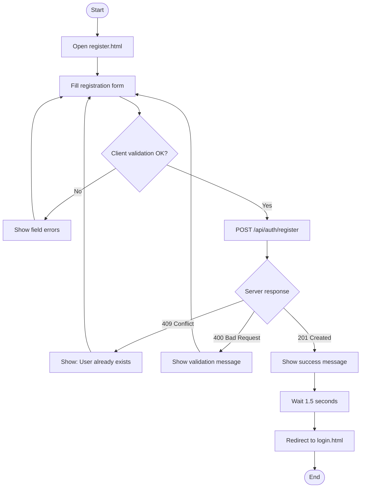
```mermaid
flowchart TD
    A([Start]) --> B[Open register.html]
    B --> C[Fill registration form]
    C --> D{Client validation OK?}
    D -- No --> E[Show field errors]
    E --> C
    D -- Yes --> F[POST /api/auth/register]
    F --> G{Server response}
    G -- 409 Conflict --> H[Show: User already exists]
    H --> C
    G -- 400 Bad Request --> I[Show validation message]
    I --> C
    G -- 201 Created --> J[Show success message]
    J --> K[Wait 1.5 seconds]
    K --> L[Redirect to login.html]
    L --> M([End])
```

### 9.2 Login Workflow

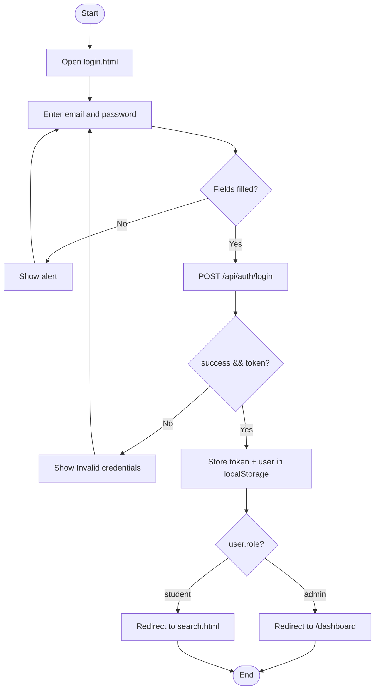
```mermaid
flowchart TD
    A([Start]) --> B[Open login.html]
    B --> C[Enter email and password]
    C --> D{Fields filled?}
    D -- No --> E[Show alert]
    E --> C
    D -- Yes --> F[POST /api/auth/login]
    F --> G{success && token?}
    G -- No --> H[Show Invalid credentials]
    H --> C
    G -- Yes --> I[Store token + user in localStorage]
    I --> J{user.role?}
    J -- admin --> K[Redirect to /dashboard]
    J -- student --> L[Redirect to search.html]
    K --> M([End])
    L --> M
```

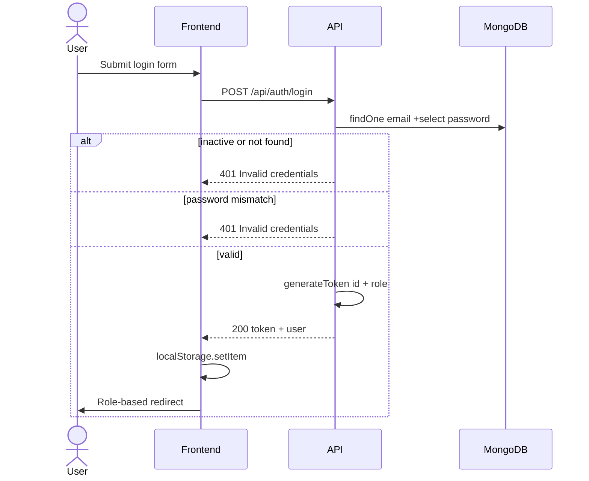
```mermaid
sequenceDiagram
    actor U as User
    participant F as Frontend
    participant A as API
    participant DB as MongoDB

    U->>F: Submit login form
    F->>A: POST /api/auth/login
    A->>DB: findOne email +select password
    alt inactive or not found
        A-->>F: 401 Invalid credentials
    else password mismatch
        A-->>F: 401 Invalid credentials
    else valid
        A->>A: generateToken id + role
        A-->>F: 200 token + user
        F->>F: localStorage.setItem
        F->>U: Role-based redirect
    end
```

### 9.3 Search Book Workflow

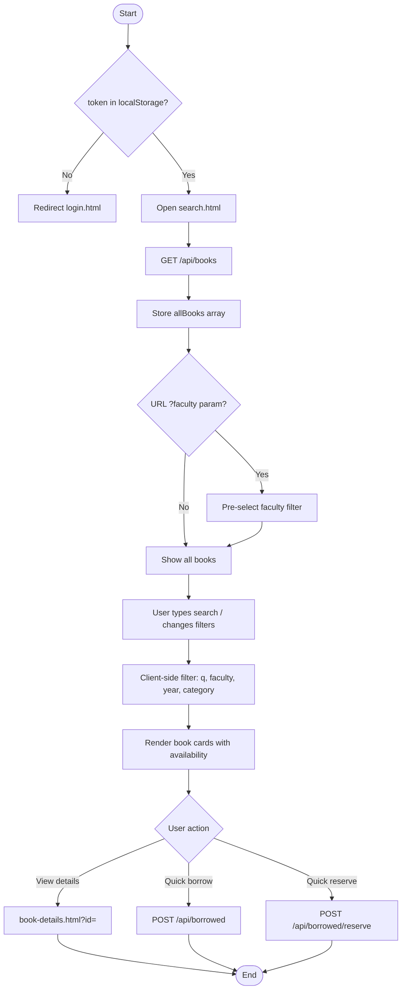
```mermaid
flowchart TD
    A([Start]) --> B{token in localStorage?}
    B -- No --> C[Redirect login.html]
    B -- Yes --> D[Open search.html]
    D --> E[GET /api/books]
    E --> F[Store allBooks array]
    F --> G{URL ?faculty param?}
    G -- Yes --> H[Pre-select faculty filter]
    G -- No --> I[Show all books]
    H --> I
    I --> J[User types search / changes filters]
    J --> K[Client-side filter: q, faculty, year, category]
    K --> L[Render book cards with availability]
    L --> M{User action}
    M -- View details --> N[book-details.html?id=]
    M -- Quick borrow --> O[POST /api/borrowed]
    M -- Quick reserve --> P[POST /api/borrowed/reserve]
    N --> Q([End])
    O --> Q
    P --> Q
```

### 9.4 Borrow Book Workflow

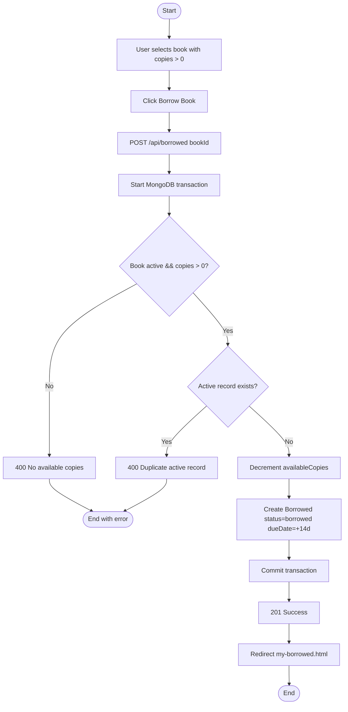
```mermaid
flowchart TD
    A([Start]) --> B[User selects book with copies > 0]
    B --> C[Click Borrow Book]
    C --> D[POST /api/borrowed bookId]
    D --> E[Start MongoDB transaction]
    E --> F{Book active && copies > 0?}
    F -- No --> G[400 No available copies]
    G --> H([End with error])
    F -- Yes --> I{Active record exists?}
    I -- Yes --> J[400 Duplicate active record]
    J --> H
    I -- No --> K[Decrement availableCopies]
    K --> L[Create Borrowed status=borrowed dueDate=+14d]
    L --> M[Commit transaction]
    M --> N[201 Success]
    N --> O[Redirect my-borrowed.html]
    O --> P([End])
```

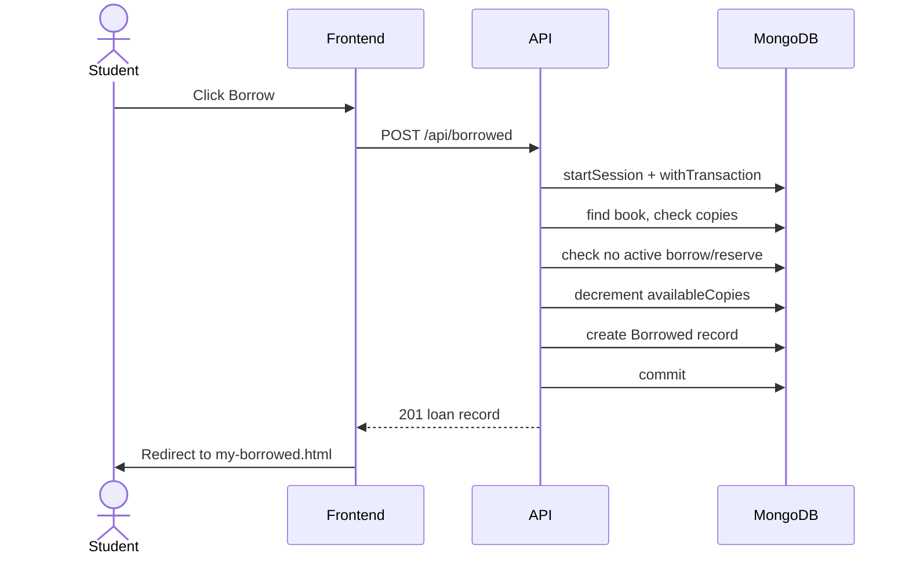
```mermaid
sequenceDiagram
    actor S as Student
    participant F as Frontend
    participant A as API
    participant DB as MongoDB

    S->>F: Click Borrow
    F->>A: POST /api/borrowed
    A->>DB: startSession + withTransaction
    A->>DB: find book, check copies
    A->>DB: check no active borrow/reserve
    A->>DB: decrement availableCopies
    A->>DB: create Borrowed record
    A->>DB: commit
    A-->>F: 201 loan record
    F->>S: Redirect to my-borrowed.html
```

### 9.5 Return Book Workflow

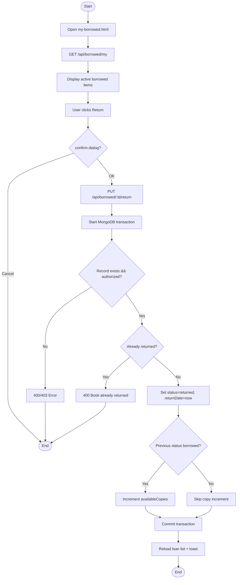
```mermaid
flowchart TD
    A([Start]) --> B[Open my-borrowed.html]
    B --> C[GET /api/borrowed/my]
    C --> D[Display active borrowed items]
    D --> E[User clicks Return]
    E --> F{confirm dialog?}
    F -- Cancel --> G([End])
    F -- OK --> H[PUT /api/borrowed/:id/return]
    H --> I[Start MongoDB transaction]
    I --> J{Record exists && authorized?}
    J -- No --> K[400/403 Error]
    K --> G
    J -- Yes --> L{Already returned?}
    L -- Yes --> M[400 Book already returned]
    M --> G
    L -- No --> N[Set status=returned, returnDate=now]
    N --> O{Previous status borrowed?}
    O -- Yes --> P[Increment availableCopies]
    O -- No --> Q[Skip copy increment]
    P --> R[Commit transaction]
    Q --> R
    R --> S[Reload loan list + toast]
    S --> T([End])
```

### 9.6 Reserve Book Workflow

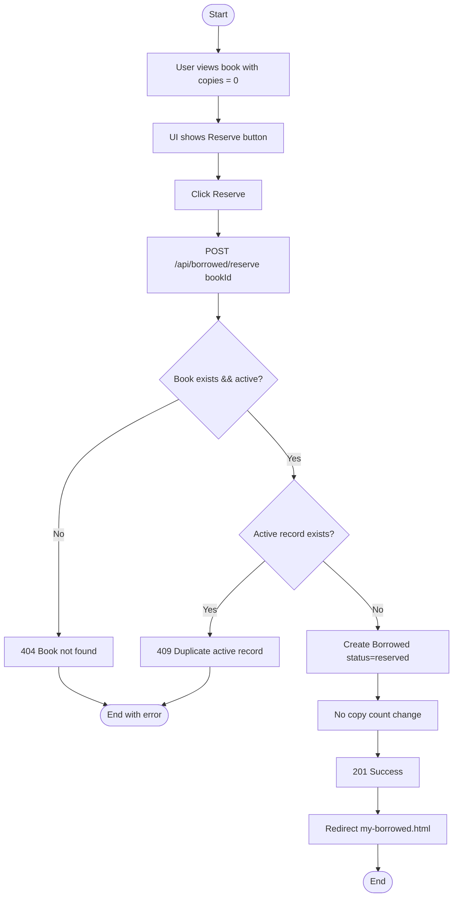
```mermaid
flowchart TD
    A([Start]) --> B[User views book with copies = 0]
    B --> C[UI shows Reserve button]
    C --> D[Click Reserve]
    D --> E[POST /api/borrowed/reserve bookId]
    E --> F{Book exists && active?}
    F -- No --> G[404 Book not found]
    G --> H([End with error])
    F -- Yes --> I{Active record exists?}
    I -- Yes --> J[409 Duplicate active record]
    J --> H
    I -- No --> K[Create Borrowed status=reserved]
    K --> L[No copy count change]
    L --> M[201 Success]
    M --> N[Redirect my-borrowed.html]
    N --> O([End])
```

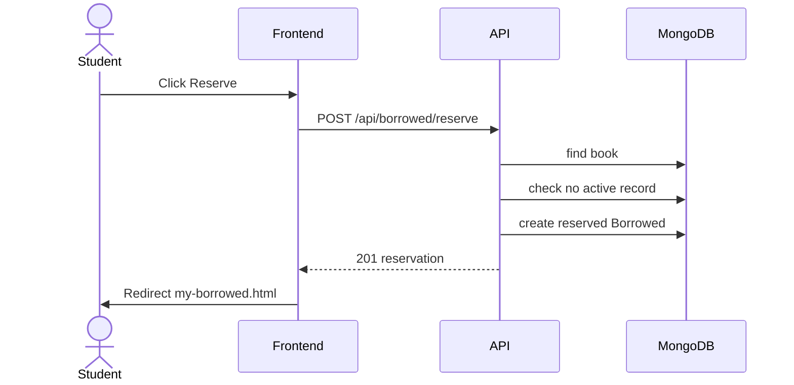
```mermaid
sequenceDiagram
    actor S as Student
    participant F as Frontend
    participant A as API
    participant DB as MongoDB

    S->>F: Click Reserve
    F->>A: POST /api/borrowed/reserve
    A->>DB: find book
    A->>DB: check no active record
    A->>DB: create reserved Borrowed
    A-->>F: 201 reservation
    F->>S: Redirect my-borrowed.html
```

### 9.7 Loan Lifecycle State Machine

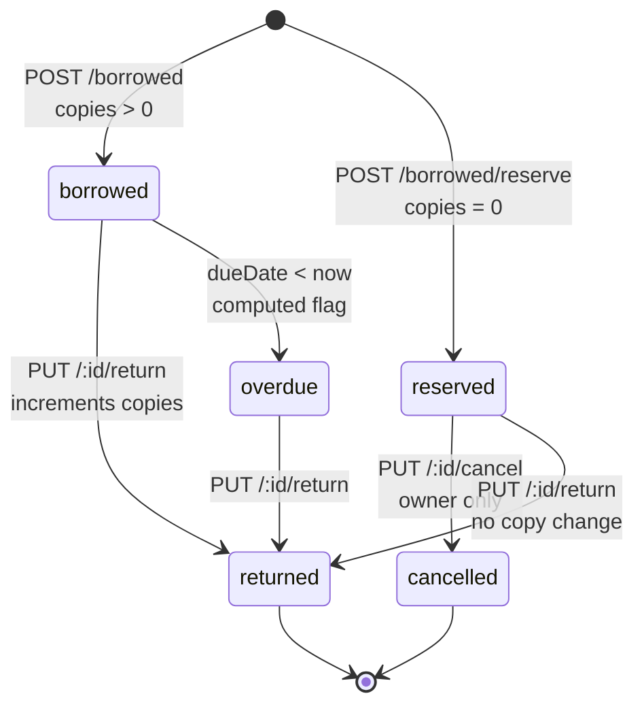
```mermaid
stateDiagram-v2
    [*] --> borrowed : POST /borrowed<br/>copies > 0
    [*] --> reserved : POST /borrowed/reserve<br/>copies = 0
    borrowed --> returned : PUT /:id/return<br/>increments copies
    reserved --> cancelled : PUT /:id/cancel<br/>owner only
    reserved --> returned : PUT /:id/return<br/>no copy change
    borrowed --> overdue : dueDate < now<br/>computed flag
    overdue --> returned : PUT /:id/return
    returned --> [*]
    cancelled --> [*]
```

### 9.8 Overall System Navigation Workflow

```mermaid
flowchart TD
    A([Start]) --> B{Authenticated?}
    B -- No --> C[Login or Register]
    C --> D{Valid?}
    D -- No --> C
    D -- Yes --> E{Role?}
    E -- Student --> F[search.html]
    E -- Admin --> G[/dashboard SPA]

    F --> H[Search / Filter Books]
    H --> I{Available?}
    I -- Yes --> J[Borrow]
    I -- No --> K[Reserve]
    J --> L[my-borrowed.html]
    K --> L
    L --> M[Return or Cancel]

    G --> N[Books / Members / Loans / Stats]
```

---

## 10. Security and Privacy Considerations

### 10.1 Authentication Security

- **Password storage:** bcrypt hashing (cost 10) via Mongoose `pre("save")` hook; `password` field excluded from queries (`select: false`).
- **JWT tokens:** Signed with `JWT_SECRET`; payload contains `{ id, role }` only; default expiry `1d` (`JWT_EXPIRES_IN`).
- **Token transmission:** Bearer header only — not query strings or cookies.

### 10.2 Authorisation Security

- **RBAC:** Admin routes use `protect` then `adminOnly` middleware chain.
- **Resource ownership:** Students may return own loans; admins may return any loan. Reservation cancellation is owner-only.
- **Active account enforcement:** `protect` middleware rejects inactive users on every protected request.

### 10.3 Input Validation and Injection Prevention

- Centralised validation in `validators.js` for register, login, book, and contact payloads.
- Mongoose schema enums, maxlength, and type constraints.
- ObjectId validation via regex before database queries.
- Request body size limited to 10 KB.

### 10.4 HTTP Security Headers

Helmet middleware sets security headers including X-Frame-Options, X-Content-Type-Options, HSTS (production), and CSP. The `x-powered-by` header is explicitly disabled.

### 10.5 CORS Policy

Origins configured via `CORS_ORIGIN` environment variable (comma-separated list). Credentials enabled for cross-origin requests where configured.

### 10.6 Data Privacy

- Passwords never returned in API responses.
- Contact message submitter details populated only in admin views.
- No third-party analytics or tracking scripts integrated.
- Sensitive configuration (`JWT_SECRET`, `MONGO_URI`) stored in `.env`, excluded from version control.

### 10.7 Frontend Security

- Protected student pages redirect to `login.html` if `localStorage.token` is absent.
- Admin dashboard verifies `role === "admin"` after login.
- HTML escaping utilities (`escHtml`, `escAttr`) used in dynamic content rendering.
- **Known limitation:** JWT in `localStorage` is vulnerable to XSS; input sanitisation and CSP mitigate but do not eliminate this risk.

---

## 11. Frontend Structure

### 11.1 Pages

| Page | File | Auth | Description |
|---|---|:---:|---|
| Landing | `index.html` | No | Project index and page navigator |
| Login | `login.html` | No | Student/admin login (role-based redirect) |
| Register | `register.html` | No | New student registration |
| Home | `combined.html` | Yes | Welcome dashboard, services, statistics |
| Search | `search.html` | Yes | Catalogue with real-time client-side filters |
| Book Details | `book-details.html` | Yes | Single book view, borrow/reserve, PDF link |
| My Books | `my-borrowed.html` | Yes | Loan tracker with return/cancel actions |
| Accessibility | `accessibility.html` | Yes | Font, contrast, screen reader, shortcuts |
| Contact | `contact.html` | Yes | Support form and library information |

### 11.2 Components and Scripts

| Component / Module | File(s) | Scope |
|---|---|---|
| Mobile sidebar navigation | `accessibility-init.js` | All student pages |
| Accessibility restoration | `accessibility-init.js` | All student pages |
| Accessibility settings UI | `accessibility.js` | `accessibility.html` |
| Auth guard | Each protected `*.js` | Token check → redirect |
| Book search & cards | `search.js` | `search.html` |
| Book detail actions | `book-details.js` | `book-details.html` |
| Loan management | `my-borrowed.js` | `my-borrowed.html` |
| Contact form | `contact.js` | `contact.html` |
| Home page logic | `combined.js` | `combined.html` |
| Unified styles | `styles.css` | All student pages |

**Admin dashboard pages (SPA):**

| View | Module | Description |
|---|---|---|
| Login | `pages/login.js` | Full-screen admin authentication |
| Dashboard | `pages/dashboard.js` | Summary statistics widgets |
| Books | `pages/books.js` | CRUD table for catalogue |
| Members | `pages/members.js` | User list, role/status management |
| Loans | `pages/loans.js` | All loans with filters and actions |

### 11.3 Navigation Flow

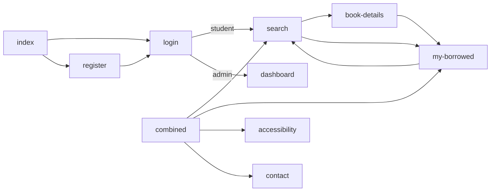
```mermaid
flowchart LR
    index --> login
    index --> register
    register --> login
    login -->|student| search
    login -->|admin| dashboard
    search --> book-details
    search --> my-borrowed
    combined --> search
    combined --> my-borrowed
    combined --> accessibility
    combined --> contact
    book-details --> my-borrowed
    my-borrowed --> search
```

---

## 12. Backend Structure

### 12.1 Controllers

| Controller | File | Functions |
|---|---|---|
| Auth | `authController.js` | `register`, `login`, `getMe`, `updateProfile`, `changePassword` |
| Book | `bookController.js` | `getBooks`, `getBookById`, `addBook`, `updateBook`, `deleteBook`, `toggleBookStatus` |
| Borrowed | `borrowedController.js` | `borrowBook`, `reserveBook`, `getBorrowed`, `getBorrowById`, `returnBook`, `cancelReservation`, `getAllBorrowed`, `getBorrowedStats` |
| Admin | `adminController.js` | `getDashboardSummary`, `getUsers`, `updateUserRole`, `toggleUserStatus`, `getBooks`, `getLibraryStats` |
| Contact | `contactController.js` | `createContactMessage`, `getContactMessages`, `updateContactStatus`, `deleteContactMessage` |

### 12.2 Routes

| Router | Mount Path | File |
|---|---|---|
| Auth | `/api/auth` | `authRoutes.js` |
| Books | `/api/books` | `bookRoutes.js` |
| Borrowed | `/api/borrowed` | `borrowRoutes.js` |
| Admin | `/api/admin` | `adminRoutes.js` |
| Contact | `/api/contact` | `contactRoutes.js` |

### 12.3 Middleware

| Middleware | File | Purpose |
|---|---|---|
| `protect` | `authMiddleware.js` | Verify JWT; attach `req.user`; block inactive accounts |
| `adminOnly` | `adminMiddleware.js` | Require `role === "admin"` |
| `notFound` | `errorMiddleware.js` | 404 for unmatched routes |
| `errorHandler` | `errorMiddleware.js` | Global error handler; hide stack in production |
| `validateRegister` | `validators.js` | Registration input validation |
| `validateLogin` | `validators.js` | Login input validation |
| `validateBook` | `validators.js` | Book create/update validation |
| `validateContact` | `validators.js` | Contact form validation |
| `isValidObjectId` | `validators.js` | MongoDB ObjectId format check |

### 12.4 Models

| Model | File | Collection |
|---|---|---|
| User | `User.js` | `users` |
| Book | `Book.js` | `books` |
| Borrowed | `Borrowed.js` | `borroweds` |
| ContactMessage | `ContactMessage.js` | `contactmessages` |

### 12.5 Services and Utilities

| Utility | File | Purpose |
|---|---|---|
| Token Generator | `utils/generateToken.js` | JWT signing with configurable expiry |
| DB Connection | `config/db.js` | `mongoose.connect()` to `MONGO_URI` |

### 12.6 Server Bootstrap Sequence

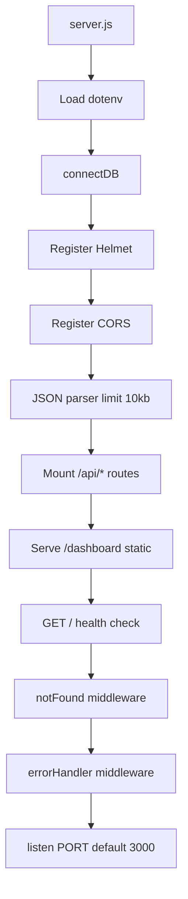
```mermaid
flowchart TD
    A[server.js] --> B[Load dotenv]
    B --> C[connectDB]
    C --> D[Register Helmet]
    D --> E[Register CORS]
    E --> F[JSON parser limit 10kb]
    F --> G[Mount /api/* routes]
    G --> H[Serve /dashboard static]
    H --> I[GET / health check]
    I --> J[notFound middleware]
    J --> K[errorHandler middleware]
    K --> L[listen PORT default 3000]
```

---

## 13. Assumptions and Constraints

### 13.1 Assumptions

1. Users have a modern browser supporting ES6+ JavaScript and the Fetch API.
2. Students use valid email addresses; the system does not currently enforce `@eelu.edu.eg` domain restriction.
3. MongoDB is available at the URI specified in `MONGO_URI` (local or Atlas).
4. Network connectivity is required; offline mode is not supported.
5. A MongoDB deployment supporting multi-document transactions is available for borrow/return operations.
6. Book cover images and PDFs are hosted at external URLs; no file upload service is provided.
7. Initial admin accounts are created directly in the database or by promoting an existing student.

### 13.2 Constraints

| Constraint | Description |
|---|---|
| **Language** | JavaScript only (no TypeScript) |
| **Database** | MongoDB only via Mongoose |
| **Authentication** | JWT only — no OAuth, SSO, or server sessions |
| **File storage** | External URLs only for media |
| **Email** | No email notification service integrated |
| **Faculties** | IT and BA only |
| **Roles** | `student` and `admin` only |
| **Body limit** | 10 KB maximum request body |
| **Deployment** | Single Node.js process; no built-in clustering |
| **Admin cancel** | Admins cannot cancel another user's reservation via API |
| **Rate limiting** | `express-rate-limit` is listed as dependency but not wired in `server.js` |

---

## 14. Future Enhancements

### 14.1 Short-Term

| Enhancement | Description |
|---|---|
| Email notifications | Registration confirmation, loan reminders, overdue alerts |
| Domain validation | Enforce `@eelu.edu.eg` during registration |
| Overdue fine system | Calculate and display penalties for late returns |
| Server-side pagination | Paginate book listings and admin tables |
| Rate limiting | Enable `express-rate-limit` on auth and borrow endpoints |
| Admin reservation management | Allow admins to cancel reservations on behalf of users |

### 14.2 Medium-Term

| Enhancement | Description |
|---|---|
| In-browser PDF viewer | Embed PDF.js for `pdfUrl` resources |
| Notification centre | In-app bell for due dates and reservation availability |
| Advanced search | Elasticsearch or Atlas Search for ranked full-text queries |
| Bulk import | Admin CSV upload for catalogue seeding |
| Audit log | Track all admin actions with timestamps |

### 14.3 Long-Term

| Enhancement | Description |
|---|---|
| Mobile application | React Native or Flutter client |
| LMS integration | Connect with EELU's Learning Management System |
| Recommendation engine | Suggest books by faculty, year, and history |
| Multi-institution support | Multi-tenancy for multiple university branches |
| RFID / barcode integration | Hybrid physical-digital library operations |
| TypeScript migration | Stronger typing for backend maintainability |

---

## Appendix A: Glossary

| Term | Definition |
|---|---|
| **EELU** | Egyptian E-Learning University |
| **JWT** | JSON Web Token — compact signed token for stateless authentication |
| **bcrypt** | Password hashing function resistant to brute-force attacks |
| **Soft delete** | Marking a record inactive (`isActive: false`) rather than deleting it |
| **ODM** | Object-Document Mapper (Mongoose) |
| **MPA** | Multi-Page Application — separate HTML documents per view |
| **SPA** | Single-Page Application — dynamic in-page view switching |
| **CORS** | Cross-Origin Resource Sharing |
| **ARIA** | Accessible Rich Internet Applications attributes |
| **WCAG** | Web Content Accessibility Guidelines |

---

## Appendix B: Environment Configuration

Create `backend/.env` with the following variables:

| Variable | Required | Default | Description |
|---|---|---|---|
| `MONGO_URI` | ✅ | — | MongoDB connection string |
| `JWT_SECRET` | ✅ | — | Secret for JWT signing (≥ 32 chars recommended) |
| `JWT_EXPIRES_IN` | — | `"1d"` | Token expiry (e.g., `"7d"`, `"2h"`) |
| `PORT` | — | `3000` | HTTP server port |
| `CORS_ORIGIN` | — | all origins | Comma-separated allowed origins |
| `NODE_ENV` | — | `development` | Set `production` to hide error stacks |

**Example `.env`:**

```env
MONGO_URI=mongodb://127.0.0.1:27017/eelu-library
JWT_SECRET=your-very-long-random-secret-key-here
JWT_EXPIRES_IN=1d
PORT=3000
CORS_ORIGIN=http://localhost:5500,http://127.0.0.1:5500
NODE_ENV=development
```

---

## Appendix C: Project Directory Structure

```
eelu-library-hub/
├── backend/
│   ├── config/db.js
│   ├── controllers/
│   ├── middleware/
│   ├── models/
│   ├── routes/
│   ├── utils/generateToken.js
│   ├── server.js
│   └── package.json
├── frontend/
│   ├── *.html
│   ├── *.js
│   └── styles.css
├── dashboard/
│   ├── index.html
│   ├── main.js
│   ├── styles.css
│   └── modules/
├── README.md
└── DOCUMENTATION.md
```

---

*End of Document — EELU Library Hub Software Engineering Documentation v1.1*

